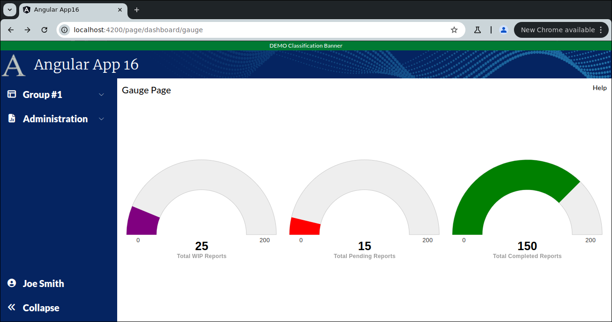

```
Exercise 25j / Create a 3-Gauge Chart  (Answer)
-----------------------------------------------


```

```


Part 1 / Update your ChartService to it has a method to return the guage data
-----------------------------------------------------------------------------
 1. Create a frontend DTO:  GaugeDataDTO
    -- It holds 4 fields:
                total_pending_reports
                total_wip_reports
                total_completed_reports
                total_reports
                
                
        export class GaugeDataDTO {
              public total_pending_reports:   number;
              public total_wip_reports:       number;
              public total_completed_reports: number;
              public total_reports:           number;
        }

 
 
 2. Create your Chart Service (if you have not already done so)
 
    
 3. Add a method:  getGaugeData()
    -- Nothing is passed-in
    -- It returns an observable of GaugeDataDTO
    -- Inside the fake dto, set the total pending to 25, 
                            set total wip reports to 15
                            set total completed reports = 150
                            set total reports           = 190

          public getGaugeData(): Observable<GaugeDataDTO> {
             let data: GaugeDataDTO = new GaugeDataDTO();
             data.total_pending_reports   = 25;
             data.total_wip_reports       = 15;
             data.total_completed_reports = 150;
            
             // Return an observable holds the data
             return of(data);
          }
        
        
          
    
      
      
Part 2 / Create the small guage component
-----------------------------------------
 1. Create the small column chart component:   GaugeSmallComponent
 
 2. Edit the Main Dashboard Page / HTML
    a. Remove the hard-coded "Chart 6"
    b. Add-in the component to your dashboard chart
    c. Make sure your this chart uses 100% of the height and width (of the parent div)
        
        <div class="w-[400px] h-[200px] mat-elevation-z4 p-2.5">
          <!-- C H A R T    6  -->
          <app-gauge-small class="h-full w-full"></app-gauge-small>
        </div>
     
    d. Verify that you see "gauge-small work!" in your dashboard
        
        
        
 
 3. Edit the small gauge component / HTML
    -- There are 3 guages in this small component
    -- Give each div 33% of the page
    -- Give each div a unique id -- e.g., gaugeChart1, gaugeChart2, gaugeChart3
    
              33%             33%             33%
        +-----------------+-----------------+-----------------+
        |   gaugeChart1   |   guargeChart2  |  guargeChart3   |
        |                 |                 |                 |
        |  Total Pending  |    Total WIP    | total Completed |     // NOTE, you do not add these labels in the HTML
        |     Reports     |     Reports     |      Reports    |     // When Highcharts renders the gauge, the label will appear
        +-----------------+-----------------+-----------------+  
           
        Gauge1 will show total pending reports 
        Gauge2 will show total work-in-progress reports
        Gauge3 will show total completed reports   
           
        <div class="grid grid-cols-3 gap-x-2 w-full h-full">
          <div id="gaugeChart1"></div>
          <div id="gaugeChart2"></div>
          <div id="gaugeChart3"></div>
        </div>
                

        
        
 4. Edit the small gauge component / TypeScript
    a. Inject your chartService
 
 
 5. Add the imports for gauges (before the @Component)
    NOTE:  Add additional imports for **GAUGES**
    
        import * as Highcharts from "highcharts";
        window.Highcharts = Highcharts;
        
        // Included because the solid gauge charts are not included in vanilla Highcharts
        import HC_more from "highcharts/highcharts-more";
        import HC_solidGauge from 'highcharts/modules/solid-gauge';
        HC_more(Highcharts);
        HC_solidGauge(Highcharts);
               
        
           
 6. Add a private class variable called chartOptions
        private gaugeChartOptions1: any;
        private gaugeChartOptions2: any;
        private gaugeChartOptions3: any;
        
        
        
        
  
 7. Set the 3 guargeChartOptions object to hold options for these 3 gauges
    a. Go to https://www.highcharts.com/demo/highcharts/gauge-solid
       *OR*
       Go to https://www.highcharts.com/
       Click on Demos
       Select "Gauges" -> "Solid gauge"
       
    b. Press JSfiddle button or "Code"
    c. Copy the configuration from the javaScript
    d. Set your chartOptions variable equal to it
    
       *OR* use this
       
               
          private gaugeChartOptions1: any = {
            chart: {
              type: 'solidgauge'
            },
            pane: {
              center: ['50%', '65%'],
              size: '100%',
              startAngle: -90,
              endAngle: 90,
              background: {
                backgroundColor: '#EEE',
                innerRadius: '60%',
                outerRadius: '100%',
                shape: 'arc'
              }
            },
        
            exporting: {
              enabled: false
            },
            tooltip: {
              enabled: false
            },
        
            // the value axis
            yAxis: {
              min: 0,
              stops: [
                [1, '#800080'] // purple
              ],
              lineWidth: 0,
              tickWidth: 0,
              minorTickInterval: null,
              tickAmount: 2,
              labels: {
                y: 16
              }
            },
            plotOptions: {
              solidgauge: {
                dataLabels: {
                  y: 5,
                  borderWidth: 0,
                  useHTML: true
                }
              }
            },
            credits: {
              enabled: false
            },
            title: {
              text: null           // set the text to null to disable the title
            },
            series: [{
              name: 'Total WIP Reports',
              dataLabels: {
                format:
                  '<div style="text-align:center">' +
                  '<span style="font-size:25px">{y}</span><br/>' +
                  '<span style="font-size:12px;opacity:0.4">Total WIP Reports</span>' +
                  '</div>'
              }
            }]
          };
        
        
          private gaugeChartOptions2: any = {
            chart: {
              type: 'solidgauge'
            },
            pane: {
              center: ['50%', '65%'],
              size: '100%',
              startAngle: -90,
              endAngle: 90,
              background: {
                backgroundColor: '#EEE',
                innerRadius: '60%',
                outerRadius: '100%',
                shape: 'arc'
              }
            },
        
            exporting: {
              enabled: false
            },
        
            tooltip: {
              enabled: false
            },
        
            // the value axis
            yAxis: {
              min: 0,
              stops: [
                [1, '#FF0000'] // red
              ],
              lineWidth: 0,
              tickWidth: 0,
              minorTickInterval: null,
              tickAmount: 2,
              labels: {
                y: 16
              }
            },
            plotOptions: {
              solidgauge: {
                dataLabels: {
                  y: 5,
                  borderWidth: 0,
                  useHTML: true
                }
              }
            },
            credits: {
              enabled: false
            },
            title: {
              text: null           // set the text to null to disable the title
            },
            series: [{
              name: 'Total Pending Reports',
              dataLabels: {
                format:
                  '<div style="text-align:center">' +
                  '<span style="font-size:25px">{y}</span><br/>' +
                  '<span style="font-size:12px;opacity:0.4">Total Pending Reports</span>' +
                  '</div>'
              }
            }]
          };
        
        
          private gaugeChartOptions3: any = {
            chart: {
              type: 'solidgauge'
            },
            pane: {
              center: ['50%', '65%'],
              size: '100%',
              startAngle: -90,
              endAngle: 90,
              background: {
                backgroundColor: '#EEE',
                innerRadius: '60%',
                outerRadius: '100%',
                shape: 'arc'
              }
            },
            exporting: {
              enabled: false
            },
            tooltip: {
              enabled: false
            },
            // the value axis
            yAxis: {
              min: 0,
              stops: [
                [1, '#008000'] // green
              ],
              lineWidth: 0,
              tickWidth: 0,
              minorTickInterval: null,
              tickAmount: 2,
              labels: {
                y: 16
              }
            },
        
            plotOptions: {
              solidgauge: {
                dataLabels: {
                  y: 5,
                  borderWidth: 0,
                  useHTML: true
                }
              }
            },
        
            credits: {
              enabled: false
            },
        
            title: {
              text: null           // set the text to null to disable the title
            },
            series: [{
              name: 'Total Completed Reports',
              dataLabels: {
                format:
                  '<div style="text-align:center">' +
                  '<span style="font-size:25px">{y}</span><br/>' +
                  '<span style="font-size:12px;opacity:0.4">Total Completed Reports</span>' +
                  '</div>'
              }
            }]
          };

    
        
 
   

 8. Create a private method:  reloadData()
    a. This method will invoke a REST call to get the data
    
    b. Set the data in the 3 objects
       Set the gaugeChartOption1 / first array element of series / data = total pending reports
       Set the gaugeChartOption1.yAxis.max = total reports
      
       Set the gaugeChartOption2 / first array element of series / data = total wip reports
       Set the gaugeChartOption2.yAxis.max = total reports
       
       Set the gaugeChartOption3 / first array element of series / data = total completed reports
       Set the gaugeChartOption4.yAxis.max = total reports    
       

    c. Tell Highcharts to render the 3 charts
               
        
          private reloadData(): void {
            this.chartService.getGaugeData().subscribe( (aData: GaugeDataDTO) => {
              // The REST Call came back with chart data
        
              // Store the updated data in the 3 gauge charts
              this.gaugeChartOptions1.series[0].data = [aData.total_pending_reports];
              this.gaugeChartOptions1.yAxis.max = aData.total_reports;
        
              this.gaugeChartOptions2.series[0].data = [aData.total_wip_reports];
              this.gaugeChartOptions2.yAxis.max = aData.total_reports;
        
              this.gaugeChartOptions3.series[0].data = [aData.total_completed_reports];
              this.gaugeChartOptions3.yAxis.max = aData.total_reports;
        
        
              // Render the 3 charts
              Highcharts.chart('gaugeChart1', this.gaugeChartOptions1);
              Highcharts.chart('gaugeChart2', this.gaugeChartOptions2);
              Highcharts.chart('gaugeChart3', this.gaugeChartOptions3);
            });
            
          }  // end of reloadData()
                  
          
          
 9. After the component has rendered the HTML, call your reloadData() method
        
          public ngAfterViewInit(): void {
          
            // NOTE:  This call must be in ngAfterViewInit() and not in ngOnInit()
            setTimeout( () => {
              // Reload the data in a setTimeout block so Angular has time to build the page
              this.reloadData();
            });
            
          }


10. Verify that you see the small gaurge chart in the dashboard page


Part 4 / Create the full-size version of this small guage component
-------------------------------------------------------------------
 1. Setup the Page
    a. Generate the component:                GaugeLargeComponent
    b. Add the route to constants.ts:         the route will be this:   page/dashboard/gauge
    c. Register the route
    d. Add the route to the database table:  ui_controls        (if using real security)
    e. Connect to http://localhost:4200/page/dashboard/gauge
       -- Verify you see "gauge-large works!"
    
       NOTE:  Do *NOT* add it to the navigation bar


 2. Setup this page layout
     +-------------------------------------------------------------------+
     | Gauge Page                                                   Help |
     +-------------------------------------------------------------------+
     |                                                                   |
     |                                                                   |
     +-------------------------------------------------------------------+


     At this point, the HTML looks like this
     ---------------------------------------      
        <div class="m-2.5">
        
         <!-- Top of Page -->
          <div class="grid grid-cols-2">
              <div>
                <span class="text-xl">Gauge Pagee</span>
              </div>
        
              <div class="flex place-content-end">
                 Help
              </div>
          </div>
        
          <!-- Bottom of Page  -->
          <div class="mt-2.5">
              
            
          </div>
        
        </div>


 3. Change the bottom of the page so use the VISIBLE height of the browser
     +-------------------------------------------------------------------+
     | Gauge Page                                                   Help |
     +-------------------------------------------------------------------+
     | Chart is here                                                     |   Height of the bottom of page *STRETCHES*
     |                                                                   |
     +-------------------------------------------------------------------+
 
        <div class="m-2.5">
        
          <div class="grid grid-cols-2">
              <div>
                <span class="text-xl">Gauge Page</span>
              </div>
        
              <div class="flex place-content-end">
                 Help
              </div>
          </div>
        
          <div class="mt-2.5">
              
              <div class="overflow-y-auto" style="height: calc(100vh - 150px)">
        
                <!--   C H A R T   -->
                Chart is here
        
              </div>
        
          </div>
        
        
        </div>
        
        
        
 4. Put your little chart in the big page

        <div class="m-2.5">
        
          <div class="grid grid-cols-2">
            <div>
              <span class="text-xl">Gauge Page</span>
            </div>
        
            <div class="flex place-content-end">
              Help
            </div>
          </div>
        
          <div class="mt-2.5">
            
            <div class="overflow-hidden" style="height: calc(100vh - 150px)">
        
                  <!--   C H A R T   -->
                  <app-gauge-small class="h-full w-full"></app-gauge-small>
        
            </div>
        
          </div>
        
        </div>


 
 5. Edit the Dashboard Page / TypeScript
    a. Inject the router
    
    b. Add a method:  navigateToGaugePage()
       -- This method should take the user to the large gauge page
 
          public navigateToGaugePage(): void {
            this.router.navigate([Constants.LARGE_GAUGE_PAGE_ROUTE]).then()
          }
  
     
    
 6. Edit the Dashboard Page / HTML
    a. Add a click handler to the div around small chart so it calls your method
 
    b. Change the cursor to a pointer if the mouse is over your small chart  (as it is clickable)
     
        <div class="w-[400px] h-[200px] mat-elevation-z4 p-2.5 cursor-pointer" (click)="this.navigateToGaugePage()">
            <!--   C H A R T   -->
            <app-gauge-small class="h-full w-full"></app-gauge-small>
        </div>
           
           
           
 7. Try it out
    a. Go to the Dashboard Page
    b. Click on the small gaurge chart
       -- It should take you to the full size page


    Large Gauge Page / HTML
    -----------------------
    <div class="m-2.5">
    
      <div class="grid grid-cols-2">
        <div>
          <span class="text-xl">Gauge Page</span>
        </div>
    
        <div class="flex place-content-end">
          Help
        </div>
      </div>
    
      <div class="mt-2.5">
    
        <div class="overflow-hidden" style="height: calc(100vh - 150px)">
    
          <!--   C H A R T   -->
          <app-gauge-small class="h-full w-full"></app-gauge-small>
    
        </div>
    
      </div>
    
    </div>
    
    
    
    Large Gauge Page / TypeScript
    -----------------------------
    import { Component } from '@angular/core';
    
    @Component({
      selector: 'app-gauge-large',
      templateUrl: './gauge-large.component.html',
      styleUrls: ['./gauge-large.component.scss']
    })
    export class GaugeLargeComponent {
    
    }
       
    
    
    Small Gauge Page / HTML
    -----------------------
    <div class="grid grid-cols-3 gap-x-2 w-full h-full">
      <div id="gaugeChart1"></div>
      <div id="gaugeChart2"></div>
      <div id="gaugeChart3"></div>
    </div>
       
    
    
    Small Gauge Page / TypeScript
    -----------------------------
    import {AfterViewInit, Component} from '@angular/core';
    import {ChartService} from "../../../services/chart.service";
    import {GaugeDataDTO} from "../../../models/gauge-data-dto";
    
    
    import * as Highcharts from "highcharts";
    window.Highcharts = Highcharts;
    
    // Included because the solid gauge charts are not included in vanilla Highcharts
    import HC_more from "highcharts/highcharts-more";
    import HC_solidGauge from 'highcharts/modules/solid-gauge';
    HC_more(Highcharts);
    HC_solidGauge(Highcharts);
    
    
    @Component({
      selector: 'app-gauge-small',
      templateUrl: './gauge-small.component.html',
      styleUrls: ['./gauge-small.component.scss']
    })
    export class GaugeSmallComponent implements AfterViewInit {
    
      public constructor(private chartService: ChartService) {
      }
    
    
      private gaugeChartOptions1: any = {
        chart: {
          type: 'solidgauge'
        },
        pane: {
          center: ['50%', '65%'],
          size: '100%',
          startAngle: -90,
          endAngle: 90,
          background: {
            backgroundColor: '#EEE',
            innerRadius: '60%',
            outerRadius: '100%',
            shape: 'arc'
          }
        },
    
        exporting: {
          enabled: false
        },
        tooltip: {
          enabled: false
        },
    
        // the value axis
        yAxis: {
          min: 0,
          stops: [
            [1, '#800080'] // purple
          ],
          lineWidth: 0,
          tickWidth: 0,
          minorTickInterval: null,
          tickAmount: 2,
          labels: {
            y: 16
          }
        },
        plotOptions: {
          solidgauge: {
            dataLabels: {
              y: 5,
              borderWidth: 0,
              useHTML: true
            }
          }
        },
        credits: {
          enabled: false
        },
        title: {
          text: null           // set the text to null to disable the title
        },
        series: [{
          name: 'Total WIP Reports',
          dataLabels: {
            format:
              '<div style="text-align:center">' +
              '<span style="font-size:25px">{y}</span><br/>' +
              '<span style="font-size:12px;opacity:0.4">Total WIP Reports</span>' +
              '</div>'
          }
        }]
      };
    
      private gaugeChartOptions2: any = {
        chart: {
          type: 'solidgauge'
        },
        pane: {
          center: ['50%', '65%'],
          size: '100%',
          startAngle: -90,
          endAngle: 90,
          background: {
            backgroundColor: '#EEE',
            innerRadius: '60%',
            outerRadius: '100%',
            shape: 'arc'
          }
        },
    
        exporting: {
          enabled: false
        },
    
        tooltip: {
          enabled: false
        },
    
        // the value axis
        yAxis: {
          min: 0,
          stops: [
            [1, '#FF0000'] // red
          ],
          lineWidth: 0,
          tickWidth: 0,
          minorTickInterval: null,
          tickAmount: 2,
          labels: {
            y: 16
          }
        },
        plotOptions: {
          solidgauge: {
            dataLabels: {
              y: 5,
              borderWidth: 0,
              useHTML: true
            }
          }
        },
        credits: {
          enabled: false
        },
        title: {
          text: null           // set the text to null to disable the title
        },
        series: [{
          name: 'Total Pending Reports',
          dataLabels: {
            format:
              '<div style="text-align:center">' +
              '<span style="font-size:25px">{y}</span><br/>' +
              '<span style="font-size:12px;opacity:0.4">Total Pending Reports</span>' +
              '</div>'
          }
        }]
      };
    
      private gaugeChartOptions3: any = {
        chart: {
          type: 'solidgauge'
        },
        pane: {
          center: ['50%', '65%'],
          size: '100%',
          startAngle: -90,
          endAngle: 90,
          background: {
            backgroundColor: '#EEE',
            innerRadius: '60%',
            outerRadius: '100%',
            shape: 'arc'
          }
        },
        exporting: {
          enabled: false
        },
        tooltip: {
          enabled: false
        },
        // the value axis
        yAxis: {
          min: 0,
          stops: [
            [1, '#008000'] // green
          ],
          lineWidth: 0,
          tickWidth: 0,
          minorTickInterval: null,
          tickAmount: 2,
          labels: {
            y: 16
          }
        },
    
        plotOptions: {
          solidgauge: {
            dataLabels: {
              y: 5,
              borderWidth: 0,
              useHTML: true
            }
          }
        },
    
        credits: {
          enabled: false
        },
    
        title: {
          text: null           // set the text to null to disable the title
        },
        series: [{
          name: 'Total Completed Reports',
          dataLabels: {
            format:
              '<div style="text-align:center">' +
              '<span style="font-size:25px">{y}</span><br/>' +
              '<span style="font-size:12px;opacity:0.4">Total Completed Reports</span>' +
              '</div>'
          }
        }]
      };
    
    
      private reloadData(): void {
        this.chartService.getGaugeData().subscribe( (aData: GaugeDataDTO) => {
          // The REST Call came back with the USA Map data
    
          // Store the updated data in the 3 gauge charts
          this.gaugeChartOptions1.series[0].data = [aData.total_pending_reports];
          this.gaugeChartOptions1.yAxis.max = aData.total_reports;
    
          this.gaugeChartOptions2.series[0].data = [aData.total_wip_reports];
          this.gaugeChartOptions2.yAxis.max = aData.total_reports;
    
          this.gaugeChartOptions3.series[0].data = [aData.total_completed_reports];
          this.gaugeChartOptions3.yAxis.max = aData.total_reports;
    
          // Render the 3 charts
          Highcharts.chart('gaugeChart1', this.gaugeChartOptions1);
          Highcharts.chart('gaugeChart2', this.gaugeChartOptions2);
          Highcharts.chart('gaugeChart3', this.gaugeChartOptions3);
        });
    
      }  // end of reloadData()
    
      public ngAfterViewInit(): void {
    
        setTimeout( () => {
          this.reloadData();
        })
      }
    
    }
        
        
        
```