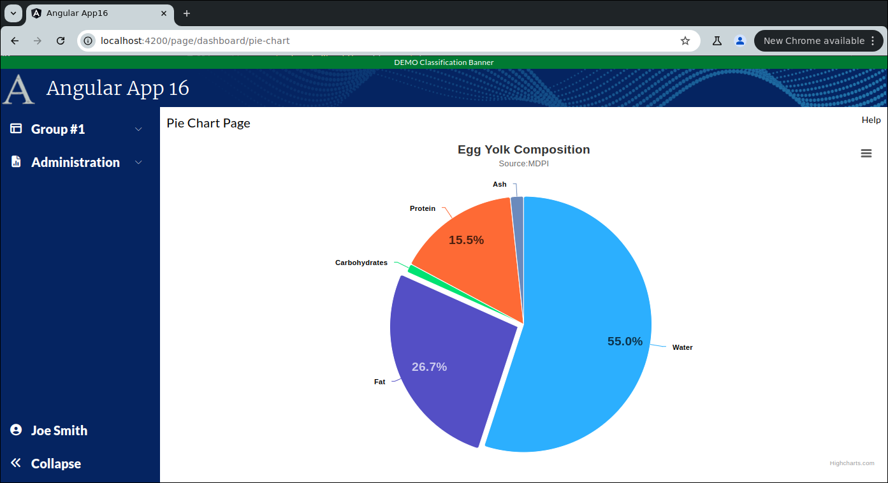

```
Exercise 25k / Change the Chart Theme Dynamically
-------------------------------------------------
Problem:  I want to change the theme of my chart


```



```


Part 1 / Adjust the full chart page's context menu so it can adjust the theme
-----------------------------------------------------------------------------
 1. Edit the small pie chart page / TypeScript
 
 2. Change the context menu so it has a light mode and dark mode options
    a. Add in the context options (so we're not using the default ones)
    
    b. Add a method:  toggleChartTheme()
       -- This method have a log statement for now
                  
    c. Add the custom Context Menu option called 'Toggle Chart Theme'
       -- Clicking on it should call your toggleChartTheme() method
           
    d. Verify that the button works
    
    
    
    
Part 2 / Add the Dark Unica Theme to your Chart Service
-------------------------------------------------------
 1. Get the dark mode javascript from highcharts
    -- Open up frontend/node_modules/highcharts/themes/dark-unica.src.js
    
    -- Copy the code lines 62 to 252
    
              DarkUnicaTheme.options = {
                colors: [
  
              }
              
 2. Insert the dark theme into your chart service (so that many charts can use it)
    a. Edit your frontend chart service
    
    b. Add a public class variable:  darkUnicaTheme
   
    c. Set your public class variable to hold that large object
                
   


    
Part 3 / Change your theme from default to Dark Unica
-----------------------------------------------------
 1. Edit your small chart component
 
 
 2. Inject the chartService  (if you have not already)
 
 
 3. Add a private class variable:  useDarkMode
    -- By default, set it to false
  
  
 4. Edit your toggleChartTheme()
    a. It must flip the useDarkMode flag
    b. It must call reloadData(0;
 
 
 5. Edit the reloadData() method
    If useDarkMode == true,  then render the chart normally
    If useDarkMode == false, then you want to merge the map and apply the dark unica theme
    
    
 6. Try it out
   

```