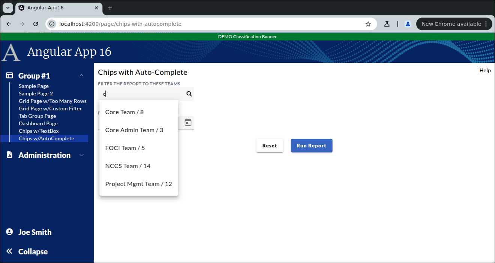
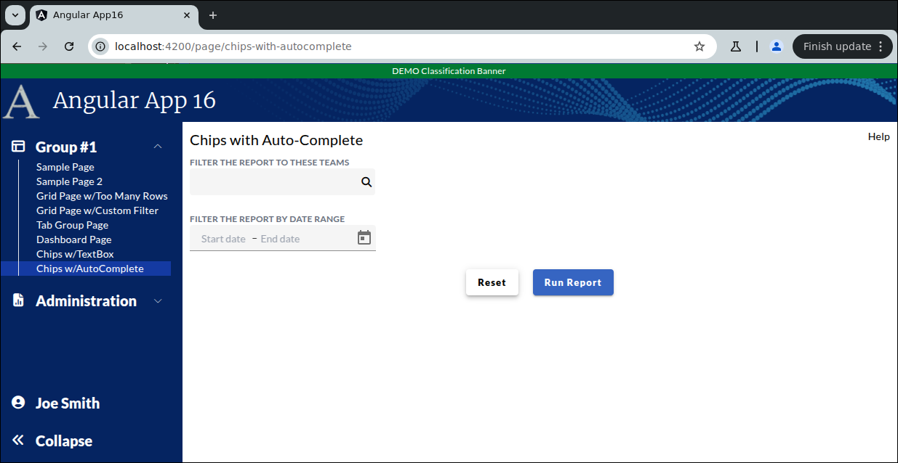

```
Exercise 26b / Chips / User Chips with an Autocomplete Text Box  (Answers)
--------------------------------------------------------------------------
Problem:  I want a user to enter multiple discrete things from an auto-complete textbox
          I want the user to know that each selected item is removable
          

```



```


Part 1 / Setup the Page
-----------------------
 1. Create the Page
    a. Generate the component                 ChipsWithAutoCompletePage
    b. Add the route to constants.ts:         the route will be this:   page/chips-with-autocomplete
    c. Register the route
    d. Add the route to the database table:  ui_controls        (if using real security)
    e. Add a link to the navbar (using that route)
    f. Use the debugger to verify that the navbar link works


 2. Setup the layout
    NOTE:  Do *NOT* add form controls yet

    +----------------------------------------------------------------------+
    | Chips with Auto-Complete                                        Help |
    +----------------------------------------------------------------------+ 
    |                                                                      |
    | Filter the report by teams:                                          | Give it a width of half of the page
    | <Enter Team Textbox>                                                 |
    |                                                                      | Put a 25px vertical gap between the controls
    | Filter the report by date range                                      |
    | <Choose Start and End Date>                                          |
    |                                                                      |
    |                        <Reset Btn>   <Run Report Btn>                |
    +----------------------------------------------------------------------+
        

        At this point, the HTML looks like this:
        ---------------------------------------
        <div class="m-2.5">
          <div class="grid grid-cols-2">
            <div><span class="text-xl">Chips with Auto-Complete</span></div>
        
            <div class="flex place-content-end">Help</div>
          </div>
        
          <div class="overflow-y-auto mt-2.5" style="height: calc(100vh - 150px)">
        
            <div class="flex flex-col gap-y-[25px]">
        
              <div>
                Filter the report to these teams
              </div>
        
              <div>
                Filter the report by date range
              </div>
        
        
        
              <!-- Button Row -->
              <div class="flex place-content-center gap-x-5">
                <div>Reset Btn</div>
                <div>Run Report Btn</div>
              </div>
            </div>
        
          </div>
        </div>


 3. Put the modern "2020 style" labels above the HTML form fields


 4. Add real HTML form fields
 


    At this point, the HTML lools like this:
    ----------------------------------------
    <div class="m-2.5">
      <div class="grid grid-cols-2">
        <div><span class="text-xl">Chips with Auto-Complete</span></div>
    
        <div class="flex place-content-end">Help</div>
      </div>
    
      <div class="overflow-y-auto mt-2.5" style="height: calc(100vh - 150px)">
    
        <div class="flex flex-col gap-y-[25px]">
    
          <!--   F I L T E R     B Y     T E A M     T E X T B O X   -->
          <div>
            <span class="app-form-label">Filter the report to these teams</span>
            <mat-form-field class="max-reduced-density w-1/2">
              <input matInput type="text"/>
    
            </mat-form-field>
          </div>
    
          <!--   D A T E       R A N G E       C O N T R O L S    -->
          <div>
            <span class="app-form-label">Filter the report by date range</span>
            <mat-form-field class="max-reduced-density !h-[36px]" subscriptSizing="dynamic">
              <!-- Date Range / Date Textbox that holds start & end dates -->
              <mat-date-range-input [rangePicker]="picker">
                <input matStartDate placeholder="Start date">
                <input matEndDate placeholder="End date">
              </mat-date-range-input>
    
              <!-- Date Range / Date Picker Icon -->
              <mat-datepicker-toggle class="max-reduced-calendar" matIconSuffix [for]="picker"></mat-datepicker-toggle>
              <mat-date-range-picker #picker></mat-date-range-picker>
            </mat-form-field>
          </div>
    
    
    
          <!-- Button Row -->
          <div class="flex place-content-center gap-x-5">
            <div>
              <button type="button" mat-raised-button title="Reset">Reset</button>
            </div>
    
            <div>
              <button type="button" mat-raised-button color="primary" title="Run Report">Run Report</button>
            </div>
          </div>
        </div>
    
      </div>
    </div>
    


 5. Setup a Reactive Form and bind the controls to the form
    NOTE:  Your reactive form needs 3 fields:
                 startDate
                 endDate
                 teams


 6. Pressing Submit does nothing
    Pressing Reset  clears resets the entire form


    The HTML so far
    ---------------
    <form [formGroup]="this.myForm" autocomplete="off" novalidate>
      <div class="m-2.5">
        <div class="grid grid-cols-2">
          <div><span class="text-xl">Chips with Auto-Complete</span></div>
    
          <div class="flex place-content-end">Help</div>
        </div>
    
        <div class="overflow-y-auto mt-2.5" style="height: calc(100vh - 150px)">
    
          <div class="flex flex-col gap-y-2.5">
    
            <!--   F I L T E R     B Y     T E A M     T E X T B O X   -->
            <div>
              <span class="app-form-label">Filter the report to these teams</span>
              <mat-form-field class="max-reduced-density w-1/2">
                <input matInput type="text" formControlName="teams" />
    
              </mat-form-field>
            </div>
    
            <!--   D A T E       R A N G E       C O N T R O L S    -->
            <div>
              <span class="app-form-label">Filter the report by date range</span>
              <mat-form-field class="max-reduced-density !h-[36px]" subscriptSizing="dynamic">
                <!-- Date Range / Date Textbox that holds start & end dates -->
                <mat-date-range-input [rangePicker]="picker">
                  <input matStartDate placeholder="Start date" formControlName="startDate">
                  <input matEndDate placeholder="End date" formControlName="endDate">
                </mat-date-range-input>
    
                <!-- Date Range / Date Picker Icon -->
                <mat-datepicker-toggle class="max-reduced-calendar" matIconSuffix [for]="picker"></mat-datepicker-toggle>
                <mat-date-range-picker #picker></mat-date-range-picker>
              </mat-form-field>
            </div>
    
    
            <!-- Button Row -->
            <div class="flex place-content-center gap-x-5">
              <div>
                <button type="button" (click)="this.resetClicked()" mat-raised-button title="Reset">Reset</button>
              </div>
    
              <div>
                <button type="button" mat-raised-button color="primary" title="Run Report">Run Report</button>
              </div>
            </div>
          </div>
    
        </div>
      </div>
    </form>


   
    
    The TypeScript so far
    ---------------------
    import {Component, OnInit} from '@angular/core';
    import {FormBuilder, FormGroup} from "@angular/forms";
    
    @Component({
      selector: 'app-chip-with-autocomplete',
      templateUrl: './chip-with-autocomplete.component.html',
      styleUrls: ['./chip-with-autocomplete.component.scss']
    })
    export class ChipWithAutocompleteComponent implements OnInit {
    
      public myForm: FormGroup;
    
      public constructor(private formBuilder: FormBuilder) {}
    
      public ngOnInit(): void {
        // Initialize the form group
        this.myForm = this.formBuilder.group({
          startDate:     [null, null],
          endDate:       [null, null],
          teams:         [null, null],
        });
      }
    
    
      public resetClicked(): void {
        this.myForm.reset();
      }
    
    }
    

                  
Part 2 / Make the input box look like a search box
--------------------------------------------------
 1. Start with the symbol textbox:

        <mat-form-field class="max-reduced-density w-1/2">
            <input matInput type="text" formControlName="teams" title="Search for Teams" aria-label="Search for Teams"/>
        </mat-form-field>

 
 2. Strip off any mat-form-field tags
 

 3. Add a span that holds a search icon (after the input box) 

        <!-- Teams Text Box -->
        <input matInput type="text" formControlName="teams" title="Search for Teams" aria-label="Search for Teams"/>
        
        <!-- Search Icon -->
        <span class="searchBoxIcon">
            <i class="fa fa-search"></i>
        </span>


 4. Add a wrapper div around it with the class of searchBoxWrapper and fa-border

      <div class="searchBoxWrapper fa-border">
          <!-- Teams Text Box -->
          <input id="searchBox" matInput type="text" formControlName="teams" title="Search for Teams" aria-label="Search for Teams"/>

          <!-- Search Icon -->
          <span class="searchBoxIcon">
            <i class="fa fa-search"></i>
        </span>
      </div>


 5. Add the searchBoxWrapper CSS class:
        
        .searchBoxWrapper {
          background-color: whitesmoke;
          border-radius: 4px;
          border: 0;
        
          /* Center the search box and the icon */
          display: flex;
          flex-direction: row;
          align-items: center;
        
          width: 255px;                   /* Set the width of the search box wrapper */
        }


    At this point, it looks better
    -- We use the wrapper div to combine the text-box and icon into one continuous box
    -- Also, the wrapper div will center the search box and the icon


 6. Add more polish by adding this CSS:
    a. Add id="searchBox" to the textbox

    b. Add this CSS:
    
        #searchBox {
          width: 235px;                      /* Set the width of the search box */
          padding: 6px 0 6px 10px;
          background-color: whitesmoke;      /* light white color */
          border: 0;
          color: #111;                       /* Text color is almost black */
        
          /* Remove the outline that appears when clicking in textbox */
          outline: none;
        }
        
        .searchBoxIcon {
          color: black;
          padding: 6px 1px 6px 1px;
          cursor: pointer;
          border: 0;
          background-color: transparent;
        }


    At this point, your page looks like this:
```

```
  

    When finished, the HTML looks like this:
    ----------------------------------------
    <form [formGroup]="this.myForm" autocomplete="off" novalidate>
      <div class="m-2.5">
        <div class="grid grid-cols-2">
          <div><span class="text-xl">Chips with Auto-Complete</span></div>
    
          <div class="flex place-content-end">Help</div>
        </div>
    
        <div class="overflow-y-auto mt-2.5" style="height: calc(100vh - 150px)">
    
          <div class="flex flex-col gap-y-[25px]">
    
            <!--   F I L T E R     B Y     T E A M     T E X T B O X   -->
            <div class="bg-transparent">
              <span class="app-form-label">Filter the report to these teams</span>
    
              <div class="searchBoxWrapper fa-border ">
                  <!-- Teams Text Box -->
                  <input id="searchBox" matInput type="text" formControlName="teams" title="Search for Teams" aria-label="Search for Teams"/>
    
                  <!-- Search Icon -->
                  <span class="searchBoxIcon">
                    <i class="fa fa-search"></i>
                </span>
              </div>
            </div>
    
            <!--   D A T E       R A N G E       C O N T R O L S    -->
            <div class="w-[300px]">
              <span class="app-form-label">Filter the report by date range</span>
              <mat-form-field class="max-reduced-density !h-[36px]" subscriptSizing="dynamic">
                <!-- Date Range / Date Textbox that holds start & end dates -->
                <mat-date-range-input [rangePicker]="picker">
                  <input matStartDate placeholder="Start date" formControlName="startDate">
                  <input matEndDate placeholder="End date" formControlName="endDate">
                </mat-date-range-input>
    
                <!-- Date Range / Date Picker Icon -->
                <mat-datepicker-toggle class="max-reduced-calendar" matIconSuffix [for]="picker"></mat-datepicker-toggle>
                <mat-date-range-picker #picker></mat-date-range-picker>
              </mat-form-field>
            </div>
    
    
            <!-- Button Row -->
            <div class="flex place-content-center gap-x-5">
              <div>
                <button type="button" (click)="this.resetClicked()" mat-raised-button title="Reset">Reset</button>
              </div>
    
              <div>
                <button type="button" mat-raised-button color="primary" title="Run Report">Run Report</button>
              </div>
            </div>
          </div>
    
        </div>
      </div>
    </form>


    When finished, the CSS looks like this:
    ---------------------------------------
    .searchBoxWrapper {
      background-color: whitesmoke;
      border-radius: 4px;
      border: 0;
    
      /* Center the search box and the icon */
      display: flex;
      flex-direction: row;
      align-items: center;
    
      width: 255px;                   /* Set the width of the search box wrapper */
    }
    
    #searchBox {
      width: 235px;                      /* Set the width of the search box */
      padding: 6px 0 6px 10px;
      background-color: whitesmoke;   /* light white color */
      border: 0;
      color: #111;            /* Text color is almost black */
    
      /* Remove the outline that appears when clicking in textbox */
      outline: none;
    }
    
    .searchBoxIcon {
      color: black;
      padding: 6px 1px 6px 1px;
      cursor: pointer;
      border: 0;
      background-color: transparent;
    }


Part 3 / Create a frontend service that runs a search
-----------------------------------------------------
 1. Add a front-end DTO class:  AutoCompleteMatchTeamDTO
    a. Generate the class
       terminal> ng generate class models/AutoCompleteMatchTeamDTO
       
    b. Add 3 public properties:
              teamId             (it's a number that holds the unique team id)
             teamDisplayedName  (it's the displayed name of the team)
             teamPersonCount    (it's the total number of people in the team)


        export class AutoCompleteMatchTeamDTO {
          public teamId:          number;
          public teamName:        string;
          public teamPersonCount: number;
        }
        


 2. Add a front-end service:  ReportService
    a. Generate the ReportService
       terminal> ng generate service services/report
    
       
    b. Add a public method:  runTeamSearch()
        -- This method returns an observable to an array of AutoCompleteMatchTeamDTO
        -- This method takes-in the rawQueryString and the total number of matches to return

         public runTeamSearch(aRawQuery: string, aTotalMatchesToReturn: number) Observable< AutoCompleteMatchTeamDTO[] > {

         }


    c. Add these checks to your method
            If the user enters a null or empty string that return an observable that contains an empty array

            if the user enters a team name that starts with "c", then return an observable with an array of 5 matches
                    Core Team           / 8 Total   / id is 1 
                    Core Admin Team     / 3 Total   / id is 2
                    FOCI Team           / 5 Total   / id is 3
                    NCCS Team           / 14 Total  / id is 4
                    Project Mgmt Team   / 12 total  / id is 6
                    
            If the user enters a string that starts with "P", then return an observable that contains an array of 3 matches:
                    PMO Team            / 8 Total   / id is 5
                    Project Mgmt Team   / 12 Total  / id is 6
                    FOCI Team           / 5 Total   / id is 7

            If the user enters a string that start with "te", then return an observable that contains an array of 23 matches:
                    Internal Test Team   / 2 Total  / id is 8 
                    External Test Team   / 5 total  / id is 9
        
        
          public runTeamSearch(aRawQuery: string, aTotalMatchesToReturn: number) : Observable< AutoCompleteMatchTeamDTO[] > {
            if (!aRawQuery) {
              // The search box is empty.  So, return an empty list (and do not invoke a REST call)
              return of( [] );
            }
        
            const trimmedQueryLowerCase: string = aRawQuery.trim().toLowerCase();
        
        
            if (trimmedQueryLowerCase == '') {
              // The search box is all spaces.  So, return an empty list  (and do NOT invoke a REST call)
              return of( [] );
            }
        
            if (trimmedQueryLowerCase.startsWith('c')) {
              // The query starts with v
        
              let data: AutoCompleteMatchTeamDTO[] = [
                {
                  teamName: 'Core Team',
                  teamPersonCount: 8,
                  teamId: 1,
                },
                {
                  teamName: 'Core Admin Team',
                  teamPersonCount: 3,
                  teamId: 2,
                },
                {
                  teamName: 'FOCI Team',
                  teamPersonCount: 5,
                  teamId: 3,
                },
                {
                  teamName: 'NCCS Team',
                  teamPersonCount: 14,
                  teamId: 4,
                },
                {
                  teamName: 'Project Mgmt Team',
                  teamPersonCount: 12,
                  teamId: 6,
                }
              ];
        
              return of(data);
            }
        
        
            if (trimmedQueryLowerCase.startsWith('p')) {
              // The query starts with p
              let data: AutoCompleteMatchTeamDTO[] = [
                {
                  teamName: 'PMO Team',
                  teamPersonCount: 8,
                  teamId: 5,
                },
                {
                  teamName: 'Project Mgmt Team',
                  teamPersonCount: 12,
                  teamId: 6,
                },
                {
                  teamName: 'FOCI Team',
                  teamPersonCount: 5,
                  teamId: 7,
                },
              ];
        
              return of(data);
            }
        
        
        
            if (trimmedQueryLowerCase.startsWith('te')) {
              // The query starts with p
              let data: AutoCompleteMatchTeamDTO[] = [
                {
                  teamName: 'Internal Test Team',
                  teamPersonCount: 2,
                  teamId: 8,
                },
                {
                  teamName: 'External Test Team',
                  teamPersonCount: 5,
                  teamId: 9,
                }
              ];
        
              return of(data);
            }
        
            // No matches were found.  So, return an observable that holds an empty array
            return of( [] );
          }


Part 4 / Change the Text Box into an AutoComplete
-------------------------------------------------
GOAL:  Setup an observable that will run a search
       An async-pipe will *ACTIVATE* this observable
       
 1. In your main typescript page, add a class variable:  obsSearchMatchesToShow   
    -- It is observable that holds an array of AutoCompleteMatchTeamDTO

        public obsSearchMatchesToShow: Observable<AutoCompleteMatchTeamDTO[]>;


 2. Inject your ReportService
  
          public constructor(private formBuilder: FormBuilder,
                             private reportService: ReportService) {}
                             
                     

 3. Initialize an observable that listens on the teams textbox and run searches
    NOTE:  There is no call to subscribe
           The async-pipe will subscribe (and thus activate) this observable

    Add this to ngOnInit()
    
        // Listen for changes on the teams text box
        this.obsSearchMatchesToShow = this.myForm.controls.teams.valueChanges
          .pipe(
            startWith(''),
            debounceTime(50),                      // Wait 250 msecs to give the user some time to type
            switchMap((aRawQuery: string) => {      // Use switchMap for its canceling effect:  On each observable, the previous observable is canceled
              // The user has typed-in something
    
              // Return an observable to the search (but only return up to 5 results)
              // NOTE:  The <mat-options> tag has an async pipe that will invoke this Observable
              return this.reportService.runTeamSearch(aRawQuery, 5);
            })
          );


 4. Add the <mat-autocomplete> tag after the search box
    NOTE:  It must be within the searchBoxWrapper IMMEDIATELY after the <span> that holds the Search Icon

           <mat-autocomplete #autocomplete1="matAutocomplete">

           </mat-autocomplete>


 5. Setup an async pipe *INSIDE* the <mat-autocomplete> to add <mat-options>
    NOTE:  the async pipe will active this observable:  obsSearchMatchesToShow

          <!-- Show Popup autocomplete entries for matching search results -->
          <mat-autocomplete #autocomplete1="matAutocomplete">

              <ng-container *ngIf="(this.obsSearchMatchesToShow | async) as matches">


            </ng-container>

          </mat-autocomplete>


 6. Loop through the matches and render them as <mat-option> tags
    NOTE:  This is inside the <mat-autocomplete> tag
           This is inside async pipe you created in the last step


          <!-- Show Popup autocomplete entries for matching search results -->
          <mat-autocomplete #autocomplete1="matAutocomplete">

              <ng-container *ngIf="(this.obsSearchMatchesToShow | async) as matches">

                <ng-container *ngFor="let match of matches">
                  <mat-option [value]="match"> {{match.teamName}} / {{match.teamPersonCount}}</mat-option>
                </ng-container>

            </ng-container>

          </mat-autocomplete>


 7. Adjust the search box by adding this to it:
         [matAutocomplete]="autocomplete1"

       <!-- Symbol Text Box -->
       <input formControlName="symbol" matInput type="text" title="Symbol Textbox" aria-label="Symbol Textbox"
              placeholder="Symbol" id="searchBox"  [matAutocomplete]="autocomplete1">


 8. Try it out
    -- Type-in V in the symbol box and you should see 5 matches
       PROBLEM:  The matches wrap / the matches look like shit!!


 9. Adjust the <mat-autocomplete> so that the matches do *NOT* wrap
    Add panelWidth="auto" to the mat-autocomplete


    The completed HTML for the autocomplete
    ---------------------------------------
    <!--   F I L T E R     B Y     T E A M     T E X T B O X   -->
    <div class="bg-transparent">
      <span class="app-form-label">Filter the report to these teams</span>

      <div class="searchBoxWrapper fa-border ">
          <!-- Teams Text Box -->
          <input id="searchBox" [matAutocomplete]="autocomplete1" matInput type="text" formControlName="teams"
                 title="Search for Teams" aria-label="Search for Teams"/>

          <!-- Search Icon -->
          <span class="searchBoxIcon">
            <i class="fa fa-search"></i>
        </span>

        <mat-autocomplete #autocomplete1="matAutocomplete" panelWidth="auto">
          <ng-container *ngIf="(this.obsSearchMatchesToShow | async) as matches">

            <ng-container *ngFor="let match of matches">
              <mat-option [value]="match"> {{match.teamName}} / {{match.teamPersonCount}}</mat-option>
            </ng-container>

          </ng-container>

        </mat-autocomplete>


      </div>
    </div>
    
    
    The entire TypeScript so far
    ----------------------------
    import {Component, OnInit} from '@angular/core';
    import {FormBuilder, FormGroup} from "@angular/forms";
    import {AutoCompleteMatchTeamDTO} from "../../models/auto-complete-match-team-dto";
    import {debounceTime, Observable, startWith, switchMap} from "rxjs";
    import {ReportService} from "../../services/report.service";
    
    @Component({
      selector: 'app-chip-with-autocomplete',
      templateUrl: './chip-with-autocomplete.component.html',
      styleUrls: ['./chip-with-autocomplete.component.scss']
    })
    export class ChipWithAutocompleteComponent implements OnInit {
    
      public myForm: FormGroup;
      public obsSearchMatchesToShow: Observable<AutoCompleteMatchTeamDTO[]>;
    
    
      public constructor(private formBuilder: FormBuilder,
                         private reportService: ReportService) {}
    
      
      public ngOnInit(): void {
        // Initialize the form group
        this.myForm = this.formBuilder.group({
          startDate:     [null, null],
          endDate:       [null, null],
          teams:         [null, null],
        });
    
    
        // Listen for changes on the teams text box
        this.obsSearchMatchesToShow = this.myForm.controls.teams.valueChanges
          .pipe(
            startWith(''),
            debounceTime(250),                      // Wait 250 msecs to give the user some time to type
            switchMap((aRawQuery: string) => {      // Use switchMap for its canceling effect:  On each observable, the previous observable is canceled
              // The user has typed-in something
    
              // Return an observable to the search (but only return up to 5 results)
              // NOTE:  The <mat-options> tag has an async pipe that will invoke this Observable
              return this.reportService.runTeamSearch(aRawQuery, 5);
            })
          );
    
      }
    
    
      public resetClicked(): void {
        // Reset the form
        this.myForm.reset();
      }
    
    
    }
       


Part 5 / Change the AutoComplete so that selecting an entry adds a chip
-----------------------------------------------------------------------
 1. In the Report Page TypeScript / Add a class variable:  selectedTeams
    -- This is an array of AutoCompleteMatchTeamDTO
    -- Initialize this to an empty array
    -- As the user types-in teams, this array will hold of AutoCompleteMatchTeamDTOs
    
            public selectedTeams: AutoCompleteMatchTeamDTO[] = [];
    
 
 2. In the Report Page TypeScript / The resetClicked() method should reset the array of team back to an empty array
 
            public resetClicked(): void {
                // Set the array of selectedTeams to an empty array
                this.selectedTeams = [];
            
                // Reset the form
                 this.myForm.reset();
            }
 
 3. Add a method userSelectedTeam()
    -- It takes in an AutoCompleteMatchTeamDTO
    -- It will append the object to selectedTeams
    
          public userSelectedTeam(aSelectedTeam: AutoCompleteMatchTeamDTO) {
              // Add this team to the array (so the chip appears)
              this.selectedTeams.push(aSelectedTeam);
              
              // Clear the textbox
              this.myForm.controls.teams.setValue('');
          }


 4. In the HTML / When a user selects an option in the mat-autocomplete, call the method userSelectedTeam()  and pass-in the selected object
         (optionSelected)="this.userSelectedTeam($event.option.value)"

    
 5. In the TypeScript / add a method:  removeTeam()
    -- It takesn an index-to-remove / that's a number
    -- It remove this item from the array of selected teams
    
    
          public removeTeam(aArrayIndexToRemove: number): void {
            if (aArrayIndexToRemove < 0) {
              // The array index is invalid.  So, stop here.
              return;
            }
        
            // Remove this element from the array
            this.selectedTeams.splice(aArrayIndexToRemove, 1);
          }
         
         
         
 6. In the HTML, display the chips
    -- This will be placed after the searchBoxWrapper
    -- Add a div with a flex flex-row and a gap of 20px
    -- Inside this div, add a <mat-chip-row>
    -- Insdie the <mat-chip-row>, loop through the array of selectedTeams
    
    
          <!--  D I S P L A Y       C H I P S   -->
          <div class="flex flex-row gap-x-5">
            <mat-chip-row  *ngFor="let team of this.selectedTeams; let index=index"
                           (removed)="this.removeTeam(index)">

              <div>
                <!-- The chip text -->
                {{ team.teamName }}

                <!-- Add a button to remove this chip -->
                <button matChipRemove [attr.aria-label]="'Remove ' + team.teamName">
                  <i class="fa-solid fa-circle-xmark text-black"></i>
                </button>
              </div>
            </mat-chip-row>
          </div>
 
 
 
    
    
Part 6 / Prevent users from selecting the same team TWICE
---------------------------------------------------------
 1. Add a method:   isTeamIdAlreadyInArray()
    -- Pass-in a teamID
    -- Returns TRUE  if the passed-in teamID is FOUND     in the array of selected teams
    -- Returns FALSE if the passed-in teamID is NOT FOUND in the array of selected teams
    
    
 2. Change your userSelectedTeam() method to check if your team id is found
    -- If the team ID is NOT found in the array of selected teams, then add it to the array
    

      public userSelectedTeam(aSelectedTeam: AutoCompleteMatchTeamDTO) {
        if (! this.isTeamIdAlreadyInArray(aSelectedTeam.teamId)) {
          // The passed-in teamID is *NOT* found in the array
    
          // Add this team to the array (so the chip appears)
          this.selectedTeams.push(aSelectedTeam);
        }
    
        // Clear the textbox
        this.myForm.controls.teams.setValue('');
      }
      
          
      private isTeamIdAlreadyInArray(aTeamId: number): boolean {
        let team: AutoCompleteMatchTeamDTO;
    
        for (team of this.selectedTeams) {
          if (aTeamId == team.teamId) {
            // I found this teamID in the list.  So, stop here.
            return true;
          }
        }
    
        return false;
      }
      


    The Completed HTML
    ------------------
    <form [formGroup]="this.myForm" autocomplete="off" novalidate>
      <div class="m-2.5">
        <div class="grid grid-cols-2">
          <div><span class="text-xl">Chips with Auto-Complete</span></div>
    
          <div class="flex place-content-end">Help</div>
        </div>
    
        <div class="overflow-y-auto mt-2.5" style="height: calc(100vh - 150px)">
    
          <div class="flex flex-col gap-y-[25px]">
    
            <!--   F I L T E R     B Y     T E A M     T E X T B O X   -->
            <div class="bg-transparent">
              <span class="app-form-label">Filter the report to these teams</span>
    
              <div class="searchBoxWrapper fa-border ">
                  <!-- Teams Text Box -->
                  <input id="searchBox" [matAutocomplete]="autocomplete1" matInput type="text" formControlName="teams"
                         placeholder="Enter Team Name..."
                         title="Search for Teams" aria-label="Search for Teams"/>
    
                  <!-- Search Icon -->
                  <span class="searchBoxIcon">
                    <i class="fa fa-search"></i>
                </span>
    
                <mat-autocomplete #autocomplete1="matAutocomplete" panelWidth="auto"
                                  (optionSelected)="this.userSelectedTeam($event.option.value)">
    
                  <ng-container *ngIf="(this.obsSearchMatchesToShow | async) as matches">
    
                    <ng-container *ngFor="let match of matches">
                      <mat-option [value]="match"> {{match.teamName}} / {{match.teamPersonCount}}</mat-option>
                    </ng-container>
    
                  </ng-container>
    
                </mat-autocomplete>
              </div>
    
    
    
              <!--  D I S P L A Y       C H I P S   -->
              <div class="flex flex-row gap-x-5">
                <mat-chip-row  *ngFor="let team of this.selectedTeams; let index=index"
                               (removed)="this.removeTeam(index)">
    
                  <div>
                    <!-- The chip text -->
                    {{ team.teamName }}
    
                    <!-- Add a button to remove this chip -->
                    <button matChipRemove [attr.aria-label]="'Remove ' + team.teamName">
                      <i class="fa-solid fa-circle-xmark text-black"></i>
                    </button>
                  </div>
                </mat-chip-row>
              </div>
              
              
            </div>
    
            <!--   D A T E       R A N G E       C O N T R O L S    -->
            <div class="w-[300px]">
              <span class="app-form-label">Filter the report by date range</span>
              <mat-form-field class="max-reduced-density !h-[36px]" subscriptSizing="dynamic">
                <!-- Date Range / Date Textbox that holds start & end dates -->
                <mat-date-range-input [rangePicker]="picker">
                  <input matStartDate placeholder="Start date" formControlName="startDate">
                  <input matEndDate placeholder="End date" formControlName="endDate">
                </mat-date-range-input>
    
                <!-- Date Range / Date Picker Icon -->
                <mat-datepicker-toggle class="max-reduced-calendar" matIconSuffix [for]="picker"></mat-datepicker-toggle>
                <mat-date-range-picker #picker></mat-date-range-picker>
              </mat-form-field>
            </div>
    
    
            <!-- Button Row -->
            <div class="flex place-content-center gap-x-5">
              <div>
                <button type="button" (click)="this.resetClicked()" mat-raised-button title="Reset">Reset</button>
              </div>
    
              <div>
                <button type="button" mat-raised-button color="primary" title="Run Report">Run Report</button>
              </div>
            </div>
          </div>
    
        </div>
      </div>
    </form>
        
    
    
    The Completed TypeScript
    ------------------------
    import {Component, OnInit} from '@angular/core';
    import {FormBuilder, FormGroup} from "@angular/forms";
    import {AutoCompleteMatchTeamDTO} from "../../models/auto-complete-match-team-dto";
    import {debounceTime, Observable, startWith, switchMap} from "rxjs";
    import {ReportService} from "../../services/report.service";
    
    @Component({
      selector: 'app-chip-with-autocomplete',
      templateUrl: './chip-with-autocomplete.component.html',
      styleUrls: ['./chip-with-autocomplete.component.scss']
    })
    export class ChipWithAutocompleteComponent implements OnInit {
    
      public myForm: FormGroup;
      public obsSearchMatchesToShow: Observable<AutoCompleteMatchTeamDTO[]>;
      public selectedTeams: AutoCompleteMatchTeamDTO[] = [];
    
      public constructor(private formBuilder: FormBuilder,
                         private reportService: ReportService) {}
    
    
      public ngOnInit(): void {
        // Initialize the form group
        this.myForm = this.formBuilder.group({
          startDate:     [null, null],
          endDate:       [null, null],
          teams:         [null, null],
        });
    
    
        // Listen for changes on the teams text box
        this.obsSearchMatchesToShow = this.myForm.controls.teams.valueChanges
          .pipe(
            startWith(''),
            debounceTime(50),                      // Wait 250 msecs to give the user some time to type
            switchMap((aRawQuery: string) => {      // Use switchMap for its canceling effect:  On each observable, the previous observable is canceled
              // The user has typed-in something
    
              // Return an observable to the search (but only return up to 5 results)
              // NOTE:  The <mat-options> tag has an async pipe that will invoke this Observable
              return this.reportService.runTeamSearch(aRawQuery, 5);
            })
          );
    
      }
    
    
      public resetClicked(): void {
        // Set the array of selectedTeams to an empty array
        this.selectedTeams = [];
    
        // Reset the form
        this.myForm.reset();
      }
    
    
      public userSelectedTeam(aSelectedTeam: AutoCompleteMatchTeamDTO) {
        if (! this.isTeamIdAlreadyInArray(aSelectedTeam.teamId)) {
          // The passed-in teamID is *NOT* found in the array
    
          // Add this team to the array (so the chip appears)
          this.selectedTeams.push(aSelectedTeam);
        }
    
        // Clear the textbox
        this.myForm.controls.teams.setValue('');
      }
    
    
      public removeTeam(aArrayIndexToRemove: number): void {
        if (aArrayIndexToRemove < 0) {
          // The array index is invalid.  So, stop here.
          return;
        }
    
        // Remove this element from the array
        this.selectedTeams.splice(aArrayIndexToRemove, 1);
      }
    
    
      private isTeamIdAlreadyInArray(aTeamId: number): boolean {
        let team: AutoCompleteMatchTeamDTO;
    
        for (team of this.selectedTeams) {
          if (aTeamId == team.teamId) {
            // I found this teamID in the list.  So, stop here.
            return true;
          }
        }
    
        return false;
      }
    
    
    }

```