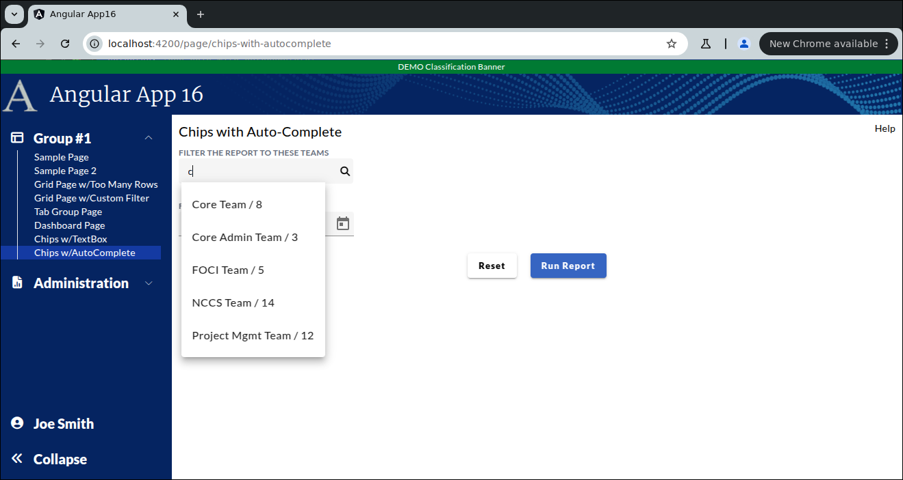
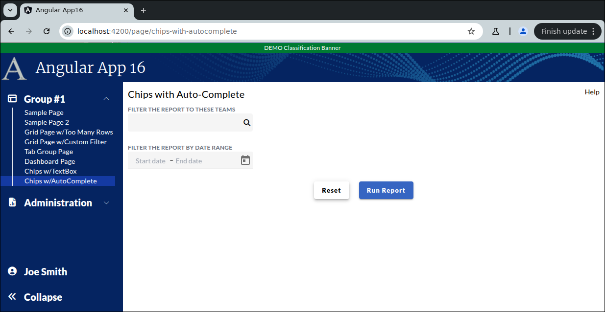

```
Exercise 26b / Chips / User Chips with an Autocomplete Text Box
---------------------------------------------------------------
Problem:  I want a user to enter multiple discrete things from an auto-complete textbox
          I want the user to know that each selected item is removable
          

```



```


Part 1 / Setup the Page
-----------------------
 1. Create the Page
    a. Generate the component                 ChipsWithAutoCompletePage
    b. Add the route to constants.ts:         the route will be this:   page/chips-with-autocomplete
    c. Register the route
    d. Add the route to the database table:  ui_controls        (if using real security)
    e. Add a link to the navbar (using that route)
    f. Use the debugger to verify that the navbar link works


 2. Setup the layout
    NOTE:  Do *NOT* add form controls yet

    +----------------------------------------------------------------------+
    | Chips with Auto-Complete                                        Help |
    +----------------------------------------------------------------------+ 
    |                                                                      |
    | Filter the report by teams:                                          | Give it a width of half of the page
    | <Enter Team Textbox>                                                 |
    |                                                                      | Put a 25px vertical gap between the controls
    | Filter the report by date range                                      |
    | <Choose Start and End Date>                                          |
    |                                                                      |
    |                        <Reset Btn>   <Run Report Btn>                |
    +----------------------------------------------------------------------+
        


 3. Put the modern "2020 style" labels above the HTML form fields


 4. Add real HTML form fields
 


 5. Setup a Reactive Form and bind the controls to the form
    NOTE:  Your reactive form needs 3 fields:
                 startDate
                 endDate
                 teams


 6. Pressing Submit does nothing
    Pressing Reset  clears resets the entire form

    

                  
Part 2 / Make the input box look like a search box
--------------------------------------------------
 1. Start with the symbol textbox:

        <mat-form-field class="max-reduced-density w-1/2">
            <input matInput type="text" formControlName="teams" title="Search for Teams" aria-label="Search for Teams"/>
        </mat-form-field>

 
 2. Strip off any mat-form-field tags
 
 
 3. Add a span that holds a search icon (after the input box) 
    -- The search icon should use the fa fa-search font-awesome class


 4. Add a wrapper div around it with the class of searchBoxWrapper and fa-border


 5. Add the searchBoxWrapper CSS class:
        
        .searchBoxWrapper {
          background-color: whitesmoke;
          border-radius: 4px;
          border: 0;
        
          /* Center the search box and the icon */
          display: flex;
          flex-direction: row;
          align-items: center;
        
          width: 255px;                   /* Set the width of the search box wrapper */
        }


    At this point, it looks better
    -- We use the wrapper div to combine the text-box and icon into one continuous box
    -- Also, the wrapper div will center the search box and the icon


 6. Add more polish by adding this CSS:
    a. Add id="searchBox" to the textbox

    b. Add this CSS:
    
        #searchBox {
          width: 235px;                      /* Set the width of the search box */
          padding: 6px 0 6px 10px;
          background-color: whitesmoke;      /* light white color */
          border: 0;
          color: #111;                       /* Text color is almost black */
        
          /* Remove the outline that appears when clicking in textbox */
          outline: none;
        }
        
        .searchBoxIcon {
          color: black;
          padding: 6px 1px 6px 1px;
          cursor: pointer;
          border: 0;
          background-color: transparent;
        }


    At this point, your page looks like this:
```

```
  

 


Part 3 / Create a frontend service that runs a search
-----------------------------------------------------
 1. Add a front-end DTO class:  AutoCompleteMatchTeamDTO
     a. Generate the class
       
     b. Add 3 public properties:
             teamId             (it's a number that holds the unique team id)
             teamDisplayedName  (it's the displayed name of the team)
             teamPersonCount    (it's the total number of people in the team)

        


 2. Add a front-end service:  ReportService
    a. Generate the ReportService
       

    b. Add a public method:  runTeamSearch()
        -- This method returns an observable to an array of AutoCompleteMatchTeamDTO
        -- This method takes-in the rawQueryString and the total number of matches to return


    c. Add these checks to your method
            If the user enters a null or empty string that return an observable that contains an empty array

            if the user enters a team name that starts with "c", then return an observable with an array of 5 matches
                    Core Team           / 8 Total   / id is 1 
                    Core Admin Team     / 3 Total   / id is 2
                    FOCI Project Team   / 5 Total   / id is 3
                    NCCS Team           / 14 Total  / id is 4
                    Project Mgmt Team   / 12 total  / id is 6
                    
            If the user enters a string that starts with "P", then return an observable that contains an array of 3 matches:
                    PMO Team            / 8 Total   / id is 5
                    Project Mgmt Team   / 12 Total  / id is 6
                    FOCI Project Team   / 5 Total   / id is 7

            If the user enters a string that start with "t", then return an observable that contains an array of 23 matches:
                    Internal Test Team   / 2 Total  / id is 8 
                    External Test Team   / 5 total  / id is 9
        


Part 4 / Change the Text Box into an AutoComplete
-------------------------------------------------
GOAL:  Setup an observable that will run a search
       An async-pipe will *ACTIVATE* this observable
       
 1. In your main typescript page, add a class variable:  obsSearchMatchesToShow   
    -- It is observable that holds an array of AutoCompleteMatchTeamDTO


 2. Inject your ReportService
  
                     

 3. Initialize an observable that listens on the teams textbox and run searches
    NOTE:  There is no call to subscribe
           The async-pipe will subscribe (and thus activate) this observable


 4. Add the <mat-autocomplete> tag after the search box
    NOTE:  It must be within the searchBoxWrapper IMMEDIATELY after the <span> that holds the Search Icon


 5. Setup an async pipe *INSIDE* the <mat-autocomplete> to add <mat-options>
    NOTE:  the async pipe will active this observable:  obsSearchMatchesToShow


 6. Loop through the matches and render them as <mat-option> tags
    NOTE:  This is inside the <mat-autocomplete> tag
           This is inside async pipe you created in the last step


 7. Adjust the search box by adding this to it:
         [matAutocomplete]="autocomplete1"


 8. Try it out
    -- Type-in V in the symbol box and you should see 5 matches
       PROBLEM:  The matches wrap / the matches look like shit!!


 9. Adjust the <mat-autocomplete> so that the matches do *NOT* wrap


 


Part 5 / Change the AutoComplete so that selecting an entry adds a chip
-----------------------------------------------------------------------
 1. In the Report Page TypeScript / Add a class variable:  selectedTeams
    -- This is an array of AutoCompleteMatchTeamDTO
    -- Initialize this to an empty array
    -- As the user types-in teams, this array will hold of AutoCompleteMatchTeamDTOs
    
    
 
 2. In the Report Page TypeScript / The resetClicked() method should reset the array of team back to an empty array
 
 
 3. Add a method userSelectedTeam()
    -- It takes in an AutoCompleteMatchTeamDTO
    -- It will append the object to selectedTeams
    


 4. In the HTML / When a user selects an option in the mat-autocomplete, call the method userSelectedTeam()  and pass-in the selected object


    
 5. In the TypeScript / add a method:  removeTeam()
    -- It takesn an index-to-remove / that's a number
    -- It remove this item from the array of selected teams
    
         
         
         
 6. In the HTML, display the chips
    -- This will be placed after the searchBoxWrapper
    -- Add a div with a flex flex-row and a gap of 20px
    -- Inside this div, add a <mat-chip-row>
    -- Insdie the <mat-chip-row>, loop through the array of selectedTeams
    

 
 
    
    
Part 6 / Prevent users from selecting the same team TWICE
---------------------------------------------------------
 1. Add a method:   isTeamIdAlreadyInArray()
    -- Pass-in a teamID
    -- Returns TRUE  if the passed-in teamID is FOUND     in the array of selected teams
    -- Returns FALSE if the passed-in teamID is NOT FOUND in the array of selected teams
    
    
 2. Change your userSelectedTeam() method to check if your team id is found
    -- If the team ID is NOT found in the array of selected teams, then add it to the array
    

   

```