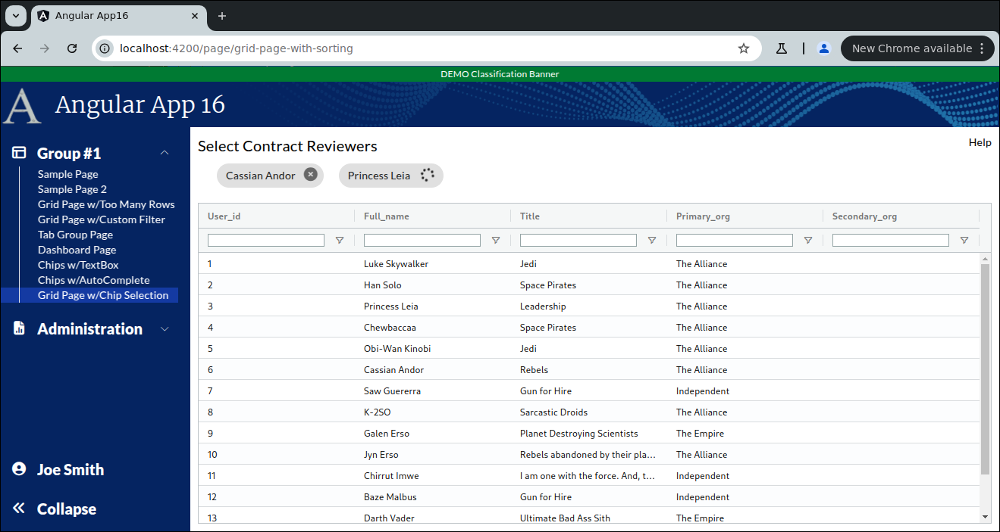
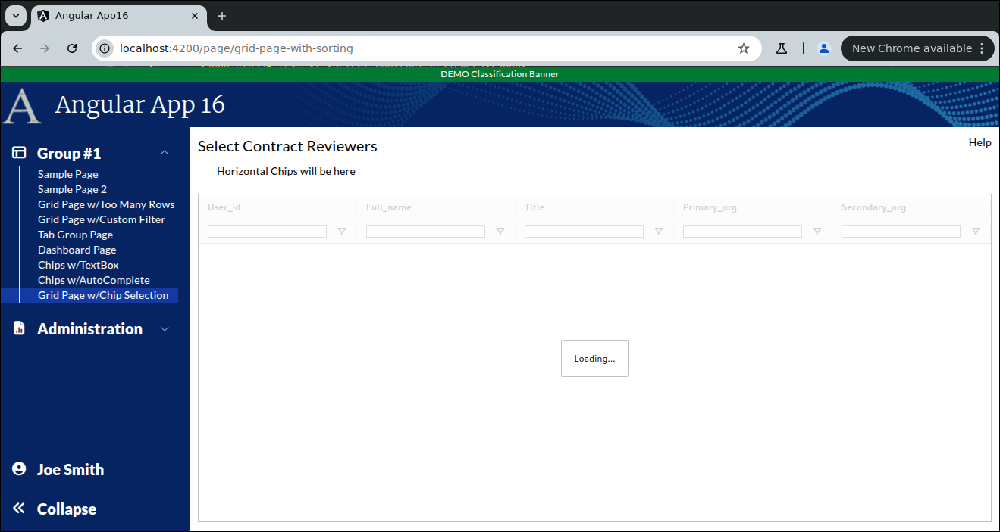

```
Exercise 26c / Chips / User Chips with a Grid  (Answers)
--------------------------------------------------------
Problem:  I want a user to select multiple items from a grid 
          I want the selections to appear at the top as a row of chips

```



```


Part 1 / Setup the Page
-----------------------
 1. Setup the Page
    a. Generate the component:                Call it GridPageWithChipSelection
    b. Add the route to constants.ts:         the route will be this:   page/grid-page-with-chip-selection
    c. Register the route
    d. Add the route to the database table:  ui_controls        (if using real security)
    e. Add a link to the navbar (using that route)
    f. Use the debugger to verify that the navbar link works


 2. Setup this page layout
     +-------------------------------------------------------------------+
     | Select Contract Reviewers                                    Help |
     +-------------------------------------------------------------------+
     |                                                                   |
     |                                                                   |
     +-------------------------------------------------------------------+


     At this point, the HTML looks like this
     ---------------------------------------      
        <div class="m-2.5">
        
         <!-- Top of Page -->
          <div class="grid grid-cols-2">
              <div>
                <span class="text-xl">Select Contract Reviewers</span>
              </div>
        
              <div class="flex place-content-end">
                 Help
              </div>
          </div>
        
          <!-- Bottom of Page  -->
          <div class="mt-2.5">
              
            
          </div>
        
        </div>


 3. Change the bottom of the page so use the VISIBLE height of the browser
     +-------------------------------------------------------------------+
     | Select Contract Reviewers                                    Help |
     +-------------------------------------------------------------------+
     |   Horizontal Chips will be here                                   |   Indent this by 25px
     +-------------------------------------------------------------------+
     | Grid is here                                                      |   Height of the bottom of page *STRETCHES*
     |                                                                   |
     +-------------------------------------------------------------------+
 
 
     At this point, the HTML looks like this
     ---------------------------------------
        <div class="m-2.5">
        
          <div class="grid grid-cols-2">
            <div>
              <span class="text-xl">Select Contract Reviewers</span>
            </div>
        
            <div class="flex place-content-end">
              Help
            </div>
          </div>
        
          <div class="mt-2.5">
            <div class="ml-[25px]">
              <!--   H O R I Z O N T A L        C H I P S   -->
              Horizontal Chips will be here
            </div>
          </div>
        
          <div class="mt-5">
            
            <div class="overflow-y-auto" style="height: calc(100vh - 180px)">
              <!-- Add Grid Here -->
              Grid is here
            </div>
        
          </div>
        
        
        </div>


 
    
Part 2 / Configure the gridOptions, columnDefs, defaultColumnDefs, and rowData 
-------------------------------------------------------------------------------
 1. Add a public class variable:   gridOpptions
    -- The type is GridOptions
    
    -- Set these properties
        domLayout: 'normal',            // Requires the wrapper div to have a height set *OR* a class="h-full" on it
        debug: false,
        rowModelType: 'clientSide',   
        
        
        public gridOptions: GridOptions = {
          domLayout: 'normal',
          debug: false,
          rowModelType: 'clientSide'
        };
        
        
 2. Add a public class variable:  columnDefs
    -- The type is array of ColDef objects
    
    -- Initialize the array to hold an object for each column definition
    
    a. Define columnDefs to hold an array of 5 objects
        the field names will be
                user_id
                full_name
                title
                primary_org
                secondary_org
                


          public columnDefs: ColDef[] = [
            {
              field: 'user_id'
            },
            {
              field: 'full_name'
            },
            {
              field: 'title'
            },
            {
              field: 'primary_org',
            },
            {
              field: 'secondary_org'
            }
          ];               
                
                
 3. Turn on sorting on *ALL* columns
    -- Define a class variable called defaultColumnDef
    -- The type is ColDef
    -- Initialize it so that flex = 1, sortable = true

        public defaultColumnDef: ColDef = {
          flex: 1,
          sortable: true,           // All columns are sortable
        }
        
  
             
 4. Turn on filters on *ALL* columns
    a. Add a class variable:  textFilterParams     
        
             // Customize the filters (when turned on)
             private textFilterParams: ITextFilterParams = {
                filterOptions: ['contains', 'notContains'],         // Customize the filter to only show "Contains" and "Not Contains"
                caseSensitive: false,                               // Filter is case-insensitive
                debounceMs: 200,
                maxNumConditions: 1                                 // Suppress the And/Or
              };
      
    b. Update the defaultColumnDefs
        -- Add filter = 'agTextColumnFilter', floatingFilter = true, filterParams is set to your textFilterParams

            public defaultColumnDef: ColDef = {
                flex: 1,
                sortable: true,                         // All columns are sortable
                floatingFilter: true,                   // Show the floating filter (beneath the column label)
                filter: 'agTextColumnFilter',           // Specify the type of filter
                filterParams: this.textFilterParams,    // Customize the filter
            }
                    
 
 
 5. Add the <ag-grid-angular> tag to your HTML 
    -- Place it where you want your grid to appear
    
    
 
 6. Tell the ag-grid-angular to use your class variables
    -- Set gridOptions property     to your public class variable
    -- Set columnDefs property      to use your public class variable
    -- Set defaultColDef property   to use your public class variable
    -- Set the grid to use 100% of the width 
    -- Set the grid to use 100% of the height
    -- Apply the ag-theme-alpine class to the grid (to set the grid's theme to "alpine"
    
          <ag-grid-angular 
                class="ag-theme-balham w-full h-full"
                [gridOptions]="this.gridOptions"
                [columnDefs]="this.columnDefs"
                [defaultColDef]="this.defaultColumnDef"
          ></ag-grid-angular>


        -- At this point, the grid is shows "Loading..." because there is no row data
```

```


Part 3 / Create the Frontend Service that will simulate a REST call (fake service)
----------------------------------------------------------------------------------
 1. Create a frontend DTO:  GridWithChipSelectionDTO
        user_id             // holds the user's id
        full_name           // this is text
        title               // this is text
        primary_org         // this is text
        secondary_org       // this is text and can be null
                
   
        export class GridWithChipSelectionDTO {
          public user_id:        number;
          public full_name:      string;
          public title:          string;
          public primary_org:    string;
          public secondary_org:  string | null;
        }


 2. Create a frontend service:  MyContractService
     a. Create this front-end service:  MyContractService 
     
     b. Add a public method:  getContractReviewers() 
        NOTE:  This method returns an observable that holds an array of GridWithChipSelectionDTO objects

     c. Fill-in this public method
        1) Create a local variable that holds an array of GridSortingRowDataDTO objects 
        2) Fill-in the array with 3 fake objects
        3) Convert the array into an observable
        4) Return the observable

        NOTE:  Make you use these date values for your first 15 records:
                user id         full_name            primary org    title
                ---------       -----------         ------------    --------------
                    1           Luke Skywalker      The Alliance    Jedi         
                    2           Han Solo            The Alliance    Space Pirates
                    3           Princess Leia       The Alliance    Leadership
                    4           Chewbaccaa          The Alliance    Space Pirates
                    5           Obi-Wan Kinobi      The Alliance    Jedi
                    6           Cassian Andor       The Alliance    Rebels
                    7           Saw Guererra        Independent     Gun for Hire
                    8           K-2SO               The Alliance    Sarcastic Droids
                    9           Galen Erso          The Empire      Planet Destroying Scientists
                    10          Jyn Erso            The Alliance    Rebels abandoned by their planet-destroying parents
                    11          Chirrut Imwe        Independent     I am one with the force.  And, the force is one with me.
                    12          Baze Malbus         Independent     Gun for Hire
                    13          Darth Vader         The Empire      Ultimate Bad Ass Sith
                    14          Grand Moff Tarkin   The Empire      Management with a sticks up their ass
                    15          Din Djarin          Mandalorians    In a category of his own
                         
        
          public getContractReviewers(): Observable<GridWithChipSelectionDTO[]> {
            let data: GridWithChipSelectionDTO[] = [
              {
                user_id: 1,
                full_name: 'Luke Skywalker',
                primary_org:   'The Alliance',
                title:          'Jedi',
                secondary_org: null
              },
              {
                user_id: 2,
                full_name: 'Han Solo',
                primary_org:   'The Alliance',
                title:          'Space Pirates',
                secondary_org: null
              },
              {
                user_id: 3,
                full_name: 'Princess Leia',
                primary_org:   'The Alliance',
                title:          'Leadership',
                secondary_org: null
              },
              {
                user_id: 4,
                full_name: 'Chewbaccaa',
                primary_org:   'The Alliance',
                title:          'Space Pirates',
                secondary_org: null
              },
              {
                user_id: 5,
                full_name: 'Obi-Wan Kinobi',
                primary_org:   'The Alliance',
                title:          'Jedi',
                secondary_org: null
              },
              {
                user_id: 6,
                full_name: 'Cassian Andor',
                primary_org:   'The Alliance',
                title:          'Rebels',
                secondary_org: null
              },
              {
                user_id: 7,
                full_name: 'Saw Guererra',
                primary_org:   'Independent',
                title:          'Gun for Hire',
                secondary_org: null
              },
              {
                user_id: 8,
                full_name: 'K-2SO',
                primary_org:   'The Alliance',
                title:          'Sarcastic Droids',
                secondary_org: null
              },
              {
                user_id: 9,
                full_name: 'Galen Erso',
                primary_org:   'The Empire',
                title:          'Planet Destroying Scientists',
                secondary_org: null
              },
              {
                user_id: 10,
                full_name: 'Jyn Erso',
                primary_org:   'The Alliance',
                title:          'Rebels abandoned by their planet-destroying parents',
                secondary_org: null
              },
              {
                user_id: 11,
                full_name: 'Chirrut Imwe',
                primary_org:   'Independent',
                title:          'I am one with the force.  And, the force is one with me.',
                secondary_org: null
              },
              {
                user_id: 12,
                full_name: 'Baze Malbus',
                primary_org:   'Independent',
                title:          'Gun for Hire',
                secondary_org: null
              },
              {
                user_id: 13,
                full_name: 'Darth Vader',
                primary_org:   'The Empire',
                title:          'Ultimate Bad Ass Sith',
                secondary_org: null
              },
              {
                user_id: 14,
                full_name: 'Grand Moff Tarkin',
                primary_org:   'The Empire',
                title:          'Management with a sticks up their ass',
                secondary_org: null
              },
              {
                user_id: 15,
                full_name: 'Din Djarin',
                primary_org:   'Mandalorians',
                title:          'In a category of his own',
                secondary_org: null
              }
            ];
        
            return of(data);
          }
        


Part 4 / Configure the grid to load it's rowData with the fake service
----------------------------------------------------------------------
 1, In the Grid Page TypeScript / Inject the MyContractService
 
        public constructor(private myContractService: MyContractService)  { }
 
 
 
 2. In the Grid Page TypeScript / Add these 2 public class variables:
        gridApi / type is GridApi
        gridColumnApi / type is ColumnApi
    
    
    
 3.  In the Grid Page TypeScript / Add a method:  onGridReady
    -- Pass-in aParams / type is GridReadyEvent
    -- initialize this.gridAPi
    -- initialize this.gridColumnApi
    -- Use the gridApi to show the "loading overlay"
    -- Invoke the fake REST call (you made in the previous step)
    -- When the REST call comes in, set the grid row data
    
      
      public onGridReady(aParams: GridReadyEvent) {
            // Get a reference to the gridApi and gridColumnApi (which we will need later to get selected rows)
            this.gridApi = aParams.api;
            this.gridColumnApi = aParams.columnApi;
        
            // Show the loading overlay
            this.gridApi.showLoadingOverlay();
        
            // Invoke the REST call to get the grid data
            this.myContractService.getContractReviewers().subscribe( (aData: GridWithChipSelectionDTO[]) => {
              // REST call came back with data
        
              // Load the grid with data from the REST call
              this.gridApi.setRowData(aData);
            })
      }
          
        
 
 4. In the HTML, tell the grid to call your onGridReady() when the grid is fully initialized
 
       (gridReady)="this.onGridReady($event)"


```

```


Part 5 / When a user-double clicks on a row, add the chip to the grid
---------------------------------------------------------------------
 1. Edit MyContractService / Add a method:  addContractReviewer()
    -- pass-in a user_id
    -- returns an observable that holds nothing
    -- Add a 3 second delay to the observable
    
          public addContractReviewer(aUserid: number): Observable<null> {
            // Simulate a REST call that takes 3 seconds
            return of(null).pipe(delay(3000));
          }
  
  
 2. Edit MyContractService / Add a method:  removeContractReviewer()
    -- pass-in a user_id
    -- returns an observable that holds nothing
    -- Add a 3 second delay to the observable
    
          public aremoveContractReviewer(aUserid: number): Observable<null> {
            // Simulate a REST call that takes 3 seconds
            return of(null).pipe(delay(3000));
          }   
        
        
        
 3. Create a frontend DTO:  SelectedReviewerDTO
        user_id                 // holds the user's id
        full_name               // this is text
        remove_in_progress      // this can be true or false
        
        
        export class SelectedReviewerDTO {
          public user_id:            number;
          public full_name:          string;
          public remove_in_progress: boolean;
        }


          
 4. In your grid page / add a class variable:  selectedReviewers
    -- This is an array of SelectedReviewerDTO
    -- Initialize it to an empty array
    
      public selectedReviewers: SelectedReviewerDTO[] = [];
      
      
      
 5. Add a public method:  addReviewer()
    -- Pass-in GridWithChipSelectionDTO
    -- It will invoke your fake frontend service to **ADD* the reviewer
    -- If the REST call is successful, then 
            add a DTO to selectedReviewers
           
           
          public addReviewer(aReviewer: GridWithChipSelectionDTO): void {
            
            // Invoke REST call to the add this contract reviewer
            this.myContractService.addContractReviewer(aReviewer.user_id).subscribe( () => {
              // The REST call succeeded.
              
              let newReviewer: SelectedReviewerDTO = {
                user_id: aReviewer.user_id,
                full_name: aReviewer.full_name,
                remove_in_progress: false
              };
              
              // Add this reviewer to the array of reviewers
              this.selectedReviewers.push(newReviewer);
            });
         }

            
 6. Add a public method:  removeReviewer()
    -- Pass-in the index in selectedReviewers
    -- It will invoke your fake frontend service to **REMOVE** the reviewer
    -- If the REST call is successful, then 
           remove the DTO from selectedReviewres
           
           
           public removeReviewer(aIndexOfSelectedReviewerToRemove: number): void {
            
                let selectedReviewer: SelectedReviewerDTO = this.selectedReviewers[aIndexOfSelectedReviewerToRemove];
                
                // Invoke REST call to the REMOVE this contract reviewer
                this.myContractService.removeContractReviewer(selectedReviewer.user_id).subscribe( () => {
                  // The REST call succeeded.
            
                  // Remove this reviewer to the array of reviewers
                  this.selectedReviewers.splice(aIndexOfSelectedReviewerToRemove, 1);
                });
           }
           
 
 7. When a user-double clicks on a row, call your addReviewer() method
 
           public gridOptions: GridOptions = {
            domLayout: 'normal',
            debug: false,
            rowModelType: 'clientSide',
        
            onRowDoubleClicked: (params: RowDoubleClickedEvent) => {
              this.addReviewer(params.data);
            },
          };
          
  
 
 8. Show the chips in the HTML
    a. Remove the label "Horizontal Chips will be here"
    
    b. Loop throgh the array of selectedReviewers
 
 
           <!--  D I S P L A Y       C H I P S   -->
           <div class="flex flex-row gap-x-5">
            <mat-chip-row  *ngFor="let team of this.selectedReviewers; let index=index"
                           (removed)="this.removeReviewer(index)">

              <div>
                <!-- The chip text -->
                {{ team.teamName }}

                <!-- Add a button to remove this chip -->
                <button matChipRemove [attr.aria-label]="'Remove ' + team.teamName">
                  <i class="fa-solid fa-circle-xmark text-black"></i>
                </button>
              </div>
            </mat-chip-row>
          </div>    
          

 9. Show a message if no reviewers are selected
    a. If no reviewers are selected, then we should show a message:  "No Reviewers Selected"
    b. If some reviewers are selected, then show the chips


Part 6:  Show a spinner while waiting for the add-contract-reviewer REST call
-----------------------------------------------------------------------------
Problme:  It takes 3 seconds to add a reviewer
          When a user double-clicks on a row, there is no feedback (indicating that a REST call was invoked)
Solution: Before invoking the REST call, set a flag and show a spinner

 1. In the Grid Page TypeScript / Add a class variable:   addReviewerInProgress
    -- It can be true or false
    -- Initialize it to false
  
 2. In the Grid Page HTML
    -- Place a spinning spinner (with font-awesome) after the page title
    -- Give the spinner a height of 18px
    -- If the flag is true, then show the spinner 
                                    |
                                    |
                                    V
     +-------------------------------------------------------------------+
     | Select Contract Reviewers <SPINNER>                          Help |
     +-------------------------------------------------------------------+
     |   Horizontal Chips will be here                                   |   Indent this by 25px
     +-------------------------------------------------------------------+
     | Grid is here                                                      |   Height of the bottom of page *STRETCHES*
     |                                                                   |
     +-------------------------------------------------------------------+  

      <div class="grid grid-cols-2">
        <div>
          <span class="text-xl">Select Contract Reviewers</span>
    
          <span *ngIf="this.addReviewerInProgress">
            <!-- We're waiting for the Add-Reviewer REST call to finish -->
            <i class="fa fa-spin fa-spinner text-[18px] ml-2.5"></i>
          </span>
    
        </div>
    
        <div class="flex place-content-end">
          Help
        </div>
      </div>

              

 3. Verify that the spinner looks good
    a. Initialize the addReviewerInProgress variable to TRUE
    
    b. Take a look at the page
        -- You should see the spinner spinning
    
    c. Reset the addReviewerInProgress variable back to FALSE
    
    
        
 3. In the Grid Page TypeScript / modify the addReviewer() method
    -- Before invoking the REST call, set this flag to true
    -- Whether the REST call works or fails, set this flag to false


          public addReviewer(aReviewer: GridWithChipSelectionDTO): void {
        
            // Show a spinner so the user knows we're waiting for a REST call
            this.addReviewerInProgress = true;
            
            // Invoke REST call to the add this contract reviewer
            this.myContractService.addContractReviewer(aReviewer.user_id).subscribe( () => {
              // The REST call succeeded.
        
              let newReviewer: SelectedReviewerDTO = {
                user_id: aReviewer.user_id,
                full_name: aReviewer.full_name,
                remove_in_progress: false
              };
        
              // Add this reviewer to the array of reviewers
              this.selectedReviewers.push(newReviewer);
            }).add( () => {
              // REST Call finally block
              
              // Hide the spinner
              this.addReviewerInProgress = false;
            });
          }

     
  
Part 7: Disable a chip while waiting for the remove-contract-reviewer REST call
-------------------------------------------------------------------------------
Problme:  It takes 3 seconds to remove a user
          When a user selects to REMOVE a user, there is no feedback (indicating that a REST call was invoked)
Solution: Show a spinner in the chip that is being deleted

 1. In the Grid Page TypeScript / edit the removeReviewer() method 
    -- When Removing the reviewer, set the review_in_progress for this DTO to be TRUE


      public removeReviewer(aIndexOfSelectedReviewerToRemove: number): void {
    
        let selectedReviewer: SelectedReviewerDTO = this.selectedReviewers[aIndexOfSelectedReviewerToRemove];
    
        // Disable this reviewer
        selectedReviewer.remove_in_progress = true;
    
        // Invoke REST call to the REMOVE this contract reviewer
        this.myContractService.removeContractReviewer(selectedReviewer.user_id).subscribe( () => {
          // The REST call succeeded.
    
          // Remove this reviewer to the array of reviewers
          this.selectedReviewers.splice(aIndexOfSelectedReviewerToRemove, 1);
        });
      }


 2. In the Grid Page HTML / When looping through the chips
    -- If remove_in_progress == false, then show the full name *AND* a "remove" button
    -- if remove_in_progress == true,  then show the full name *AND* a spinner (indicating that the remove is in progress)
     
      <div class="mt-2.5">
        <div class="ml-[25px]">
          <!--  D I S P L A Y       C H I P S   -->
          <div class="flex flex-row flex-wrap gap-x-5">
    
            <ng-container *ngIf="this.selectedReviewers.length == 0">
              <!-- No Reviewers are Selected -->
              <span class="text-xl">No Reviewers are Selected</span>
            </ng-container>
    
            <ng-container *ngIf="this.selectedReviewers.length > 0">
              <!-- One or more Reviewers are Selected -->
              <mat-chip-row  *ngFor="let reviewer of this.selectedReviewers; let index=index"
                             (removed)="this.removeReviewer(index)">
    
                <div>
                  <!-- The chip text -->
                  {{ reviewer.full_name }}
    
    
                  <ng-container *ngIf="! reviewer.remove_in_progress">
                    <!-- Chip is not being removed.  So, show the "Remove" button -->
    
                    <!-- Add a button to remove this chip -->
                    <button matChipRemove [attr.aria-label]="'Remove ' + reviewer.full_name">
                      <i class="fa-solid fa-circle-xmark text-black"></i>
                    </button>
                  </ng-container>
    
                  <ng-container *ngIf="reviewer.remove_in_progress">
                    <!-- Chip is being removed.  So, show the spinner -->
                    <i class="fa fa-spin fa-spinner text-[18px] ml-2.5"></i>
                  </ng-container>
    
                </div>
              </mat-chip-row>
            </ng-container>
          </div>
        </div>
      </div>


Part 8:  Fix the problem when removing multiple reviewers
---------------------------------------------------------
Problem:  The user adds 5 reviewers
          The user presses to remove all 5 reviewers
          -- Because we're removing by index, it may fail
         
Solution: Instead of removing the user by the index
          Remove the user from the array by looking for that user by the USER ID
          
 
     
      private removeUseridFromArray(aUserId: number): void {
        let indexOfRemovedItem: number | null = null;
    
        for (let i: number=0; i<this.selectedReviewers.length; i++) {
          if (this.selectedReviewers[i].user_id == aUserId) {
            indexOfRemovedItem = i;
            break;
          }
        }
    
        if (indexOfRemovedItem != null) {
          this.selectedReviewers.splice(indexOfRemovedItem, 1);
        }
      }
      
      
      
      public removeReviewer(aIndexOfSelectedReviewerToRemove: number): void {
    
        let selectedReviewer: SelectedReviewerDTO = this.selectedReviewers[aIndexOfSelectedReviewerToRemove];
    
        // Disable this reviewer
        selectedReviewer.remove_in_progress = true;
    
        // Invoke REST call to the REMOVE this contract reviewer
        this.myContractService.removeContractReviewer(selectedReviewer.user_id).subscribe( () => {
          // The REST call succeeded.
    
          // Remove this reviewer to the array of reviewers
          this.removeUseridFromArray(selectedReviewer.user_id);
        });
      }


    The MyContractService TypeScript
    --------------------------------
    import { Injectable } from '@angular/core';
    import {GridWithChipSelectionDTO} from "../models/grid-with-chip-selection-dto";
    import {delay, Observable, of} from "rxjs";
    
    @Injectable({
      providedIn: 'root'
    })
    export class MyContractService {
    
      constructor() { }
    
    
    
      public getContractReviewers(): Observable<GridWithChipSelectionDTO[]> {
        let data: GridWithChipSelectionDTO[] = [
          {
            user_id: 1,
            full_name: 'Luke Skywalker',
            primary_org:   'The Alliance',
            title:          'Jedi',
            secondary_org: null
          },
          {
            user_id: 2,
            full_name: 'Han Solo',
            primary_org:   'The Alliance',
            title:          'Space Pirates',
            secondary_org: null
          },
          {
            user_id: 3,
            full_name: 'Princess Leia',
            primary_org:   'The Alliance',
            title:          'Leadership',
            secondary_org: null
          },
          {
            user_id: 4,
            full_name: 'Chewbaccaa',
            primary_org:   'The Alliance',
            title:          'Space Pirates',
            secondary_org: null
          },
          {
            user_id: 5,
            full_name: 'Obi-Wan Kinobi',
            primary_org:   'The Alliance',
            title:          'Jedi',
            secondary_org: null
          },
          {
            user_id: 6,
            full_name: 'Cassian Andor',
            primary_org:   'The Alliance',
            title:          'Rebels',
            secondary_org: null
          },
          {
            user_id: 7,
            full_name: 'Saw Guererra',
            primary_org:   'Independent',
            title:          'Gun for Hire',
            secondary_org: null
          },
          {
            user_id: 8,
            full_name: 'K-2SO',
            primary_org:   'The Alliance',
            title:          'Sarcastic Droids',
            secondary_org: null
          },
          {
            user_id: 9,
            full_name: 'Galen Erso',
            primary_org:   'The Empire',
            title:          'Planet Destroying Scientists',
            secondary_org: null
          },
          {
            user_id: 10,
            full_name: 'Jyn Erso',
            primary_org:   'The Alliance',
            title:          'Rebels abandoned by their planet-destroying parents',
            secondary_org: null
          },
          {
            user_id: 11,
            full_name: 'Chirrut Imwe',
            primary_org:   'Independent',
            title:          'I am one with the force.  And, the force is one with me.',
            secondary_org: null
          },
          {
            user_id: 12,
            full_name: 'Baze Malbus',
            primary_org:   'Independent',
            title:          'Gun for Hire',
            secondary_org: null
          },
          {
            user_id: 13,
            full_name: 'Darth Vader',
            primary_org:   'The Empire',
            title:          'Ultimate Bad Ass Sith',
            secondary_org: null
          },
          {
            user_id: 14,
            full_name: 'Grand Moff Tarkin',
            primary_org:   'The Empire',
            title:          'Management with a sticks up their ass',
            secondary_org: null
          },
          {
            user_id: 15,
            full_name: 'Din Djarin',
            primary_org:   'Mandalorians',
            title:          'In a category of his own',
            secondary_org: null
          }
        ];
    
        return of(data);
      }
    
    
      public addContractReviewer(aUserid: number): Observable<null> {
        // Simulate a REST call that takes 3 seconds
        return of(null).pipe(delay(3000));
      }
    
    
      public removeContractReviewer(aUserid: number): Observable<null> {
        // Simulate a REST call that takes 3 seconds
        return of(null).pipe(delay(3000));
      }
    
    }

    
    

    The Grid Page HTML
    ------------------
    <div class="m-2.5">
    
      <div class="grid grid-cols-2">
        <div>
          <span class="text-xl">Select Contract Reviewers</span>
    
          <span *ngIf="this.addReviewerInProgress">
            <!-- We're waiting for the Add-Reviewer REST call to finish -->
            <i class="fa fa-spin fa-spinner text-[18px] ml-2.5"></i>
          </span>
    
        </div>
    
        <div class="flex place-content-end">
          Help
        </div>
      </div>
    
      <div class="mt-2.5">
        <div class="ml-[25px]">
          <!--  D I S P L A Y       C H I P S   -->
          <div class="flex flex-row flex-wrap gap-x-5">
    
            <ng-container *ngIf="this.selectedReviewers.length == 0">
              <!-- No Reviewers are Selected -->
              <span class="text-xl">No Reviewers are Selected</span>
            </ng-container>
    
            <ng-container *ngIf="this.selectedReviewers.length > 0">
              <!-- One or more Reviewers are Selected -->
              <mat-chip-row  *ngFor="let reviewer of this.selectedReviewers; let index=index"
                             (removed)="this.removeReviewer(index)">
    
                <div>
                  <!-- The chip text -->
                  {{ reviewer.full_name }}
    
    
                  <ng-container *ngIf="! reviewer.remove_in_progress">
                    <!-- Chip is not being removed.  So, show the "Remove" button -->
    
                    <!-- Add a button to remove this chip -->
                    <button matChipRemove [attr.aria-label]="'Remove ' + reviewer.full_name">
                      <i class="fa-solid fa-circle-xmark text-black"></i>
                    </button>
                  </ng-container>
    
                  <ng-container *ngIf="reviewer.remove_in_progress">
                    <!-- Chip is being removed.  So, show the spinner -->
                    <i class="fa fa-spin fa-spinner text-[18px] ml-2.5"></i>
                  </ng-container>
    
                </div>
              </mat-chip-row>
            </ng-container>
          </div>
        </div>
      </div>
    
      <div class="mt-5">
    
        <div class="overflow-y-auto" style="height: calc(100vh - 190px)">
          <!-- Add Grid Here -->
          <ag-grid-angular
            class="ag-theme-balham w-full h-full"
            [gridOptions]="this.gridOptions"
            [columnDefs]="this.columnDefs"
            [defaultColDef]="this.defaultColumnDef"
            (gridReady)="this.onGridReady($event)"
          ></ag-grid-angular>
        </div>
    
      </div>
    
    
    </div>
     
     
    The Grid Page TypeScript
    ------------------------
    import { Component } from '@angular/core';
    import { ColDef, ColumnApi, GridApi, GridOptions, GridReadyEvent, ITextFilterParams, RowDoubleClickedEvent} from "ag-grid-community";
    import {MyContractService} from "../../services/my-contract.service";
    import {GridWithChipSelectionDTO} from "../../models/grid-with-chip-selection-dto";
    import {SelectedReviewerDTO} from "../../models/selected-reviewer-dto";
    
    @Component({
      selector: 'app-grid-page-with-chip-selection',
      templateUrl: './grid-page-with-chip-selection.component.html',
      styleUrls: ['./grid-page-with-chip-selection.component.scss']
    })
    export class GridPageWithChipSelectionComponent {
    
      public constructor(private myContractService: MyContractService)  { }
    
      public gridApi: GridApi;
      public gridColumnApi: ColumnApi;
      public selectedReviewers: SelectedReviewerDTO[] = [];
      public addReviewerInProgress: boolean = false;
    
      public gridOptions: GridOptions = {
        domLayout: 'normal',
        debug: false,
        rowModelType: 'clientSide',
    
        onRowDoubleClicked: (params: RowDoubleClickedEvent) => {
          this.addReviewer(params.data);
        },
      };
    
      public columnDefs: ColDef[] = [
        {
          field: 'user_id'
        },
        {
          field: 'full_name'
        },
        {
          field: 'title'
        },
        {
          field: 'primary_org',
        },
        {
          field: 'secondary_org'
        }
      ];
    
    
      // Customize the filters (when turned on)
      private textFilterParams: ITextFilterParams = {
        filterOptions: ['contains', 'notContains'],         // Customize the filter to only show "Contains" and "Not Contains"
        caseSensitive: false,                               // Filter is case-insensitive
        debounceMs: 200,
        maxNumConditions: 1                                 // Suppress the And/Or
      };
    
    
      public defaultColumnDef: ColDef = {
        flex: 1,
        sortable: true,                         // All columns are sortable
        floatingFilter: true,                   // Show the floating filter (beneath the column label)
        filter: 'agTextColumnFilter',           // Specify the type of filter
        filterParams: this.textFilterParams,    // Customize the filter
      }
    
    
    
      public onGridReady(aParams: GridReadyEvent) {
        // Get a reference to the gridApi and gridColumnApi (which we will need later to get selected rows)
        this.gridApi = aParams.api;
        this.gridColumnApi = aParams.columnApi;
    
        // Show the loading overlay
        this.gridApi.showLoadingOverlay();
    
        // Invoke the REST call to get the grid data
        this.myContractService.getContractReviewers().subscribe( (aData: GridWithChipSelectionDTO[]) => {
          // REST call came back with data
    
          // Load the grid with data from the REST call
          this.gridApi.setRowData(aData);
        })
    
      }
    
    
      public addReviewer(aReviewer: GridWithChipSelectionDTO): void {
    
        // Show a spinner so the user knows we're waiting for a REST call
        this.addReviewerInProgress = true;
    
        // Invoke REST call to the add this contract reviewer
        this.myContractService.addContractReviewer(aReviewer.user_id).subscribe( () => {
          // The REST call succeeded.
    
          let newReviewer: SelectedReviewerDTO = {
            user_id: aReviewer.user_id,
            full_name: aReviewer.full_name,
            remove_in_progress: false
          };
    
          // Add this reviewer to the array of reviewers
          this.selectedReviewers.push(newReviewer);
        }).add( () => {
          // REST Call finally block
    
          // Hide the spinner
          this.addReviewerInProgress = false;
        });
      }
    
    
    
      public removeReviewer(aIndexOfSelectedReviewerToRemove: number): void {
    
        let selectedReviewer: SelectedReviewerDTO = this.selectedReviewers[aIndexOfSelectedReviewerToRemove];
    
        // Disable this reviewer
        selectedReviewer.remove_in_progress = true;
    
        // Invoke REST call to the REMOVE this contract reviewer
        this.myContractService.removeContractReviewer(selectedReviewer.user_id).subscribe( () => {
          // The REST call succeeded.
    
          // Remove this reviewer to the array of reviewers
          this.removeUseridFromArray(selectedReviewer.user_id);
        });
      }
    
    
      private removeUseridFromArray(aUserId: number): void {
        let indexOfRemovedItem: number | null = null;
    
        for (let i: number=0; i<this.selectedReviewers.length; i++) {
          if (this.selectedReviewers[i].user_id == aUserId) {
            indexOfRemovedItem = i;
            break;
          }
        }
    
        if (indexOfRemovedItem != null) {
          this.selectedReviewers.splice(indexOfRemovedItem, 1);
        }
      }
      
    }

```