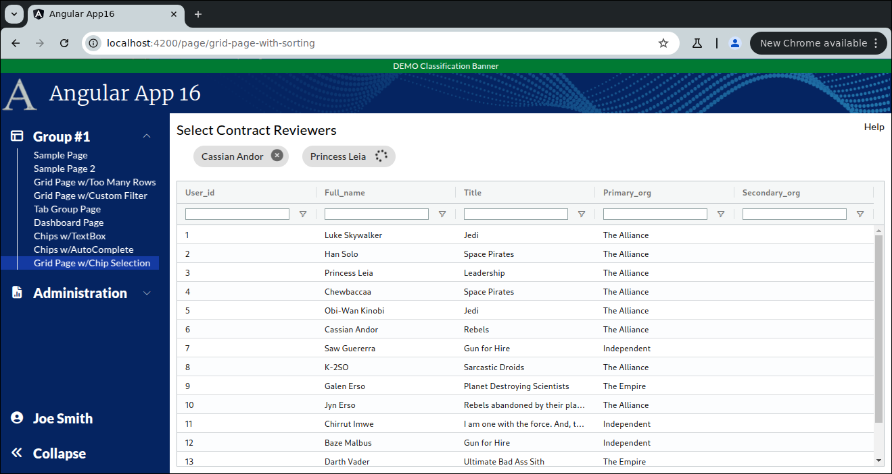
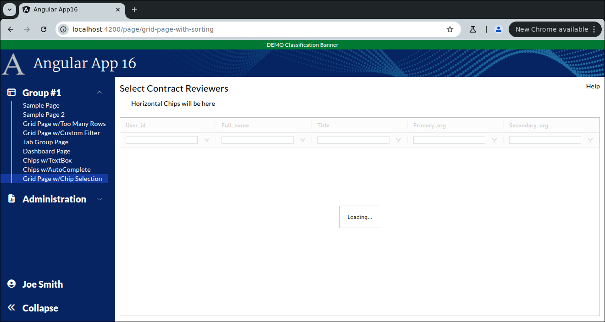
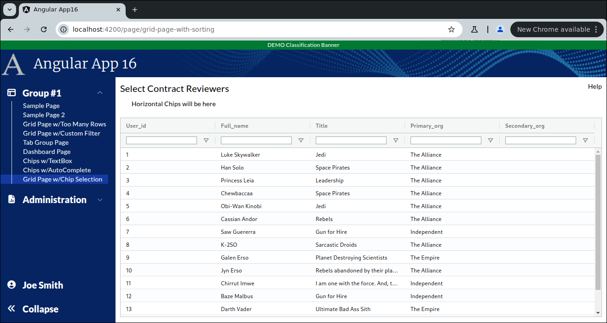

```
Exercise 26c / Chips / User Chips with a Grid
---------------------------------------------
Problem:  I want a user to select multiple items from a grid 
          I want the selections to appear at the top as a row of chips

```



```


Part 1 / Setup the Page
-----------------------
 1. Setup the Page
    a. Generate the component:                Call it GridPageWithChipSelection
    b. Add the route to constants.ts:         the route will be this:   page/grid-page-with-chip-selection
    c. Register the route
    d. Add the route to the database table:  ui_controls        (if using real security)
    e. Add a link to the navbar (using that route)
    f. Use the debugger to verify that the navbar link works


 2. Setup this page layout
     +-------------------------------------------------------------------+
     | Select Contract Reviewers                                    Help |
     +-------------------------------------------------------------------+
     |                                                                   |
     |                                                                   |
     +-------------------------------------------------------------------+


 


 3. Change the bottom of the page so use the VISIBLE height of the browser
     +-------------------------------------------------------------------+
     | Select Contract Reviewers                                    Help |
     +-------------------------------------------------------------------+
     |   Horizontal Chips will be here                                   |   Indent this by 25px
     +-------------------------------------------------------------------+
     | Grid is here                                                      |   Height of the bottom of page *STRETCHES*
     |                                                                   |
     +-------------------------------------------------------------------+
 
 
  

 
    
Part 2 / Configure the gridOptions, columnDefs, defaultColumnDefs, and rowData 
-------------------------------------------------------------------------------
 1. Add a public class variable:   gridOpptions
    -- The type is GridOptions
    
    -- Set these properties
        domLayout: 'normal',            // Requires the wrapper div to have a height set *OR* a class="h-full" on it
        rowModelType: 'clientSide',   
        
        
 2. Add a public class variable:  columnDefs
    -- The type is array of ColDef objects
    
    -- Initialize the array to hold an object for each column definition
    
    a. Define columnDefs to hold an array of 5 objects
        the field names will be
                user_id
                full_name
                title
                primary_org
                secondary_org
                
       
                
                
 3. Turn on sorting on *ALL* columns
    -- Define a class variable called defaultColumnDef
    -- The type is ColDef
    -- Initialize it so that flex = 1, sortable = true


             
 4. Turn on filters on *ALL* columns
    a. Add a class variable:  textFilterParams     
        
             // Customize the filters (when turned on)
             private textFilterParams: ITextFilterParams = {
                filterOptions: ['contains', 'notContains'],         // Customize the filter to only show "Contains" and "Not Contains"
                caseSensitive: false,                               // Filter is case-insensitive
                debounceMs: 200,
                maxNumConditions: 1                                 // Suppress the And/Or
              };
      
    b. Update the defaultColumnDefs
        -- Add filter = 'agTextColumnFilter', floatingFilter = true, filterParams is set to your textFilterParams


                    
 
 
 5. Add the <ag-grid-angular> tag to your HTML 
    -- Place it where you want your grid to appear
    
    
 
 6. Tell the ag-grid-angular to use your class variables
    -- Set gridOptions property     to your public class variable
    -- Set columnDefs property      to use your public class variable
    -- Set defaultColDef property   to use your public class variable
    -- Set the grid to use 100% of the width 
    -- Set the grid to use 100% of the height
    -- Apply the ag-theme-alpine class to the grid (to set the grid's theme to "alpine"
    


        -- At this point, the grid is shows "Loading..." because there is no row data
```

```


Part 3 / Create the Frontend Service that will simulate a REST call (fake service)
----------------------------------------------------------------------------------
 1. Create a frontend DTO:  GridWithChipSelectionDTO
        user_id             // holds the user's id
        full_name           // this is text
        title               // this is text
        primary_org         // this is text
        secondary_org       // this is text and can be null
                


 2. Create a frontend service:  MyContractService
     a. Create this front-end service:  MyContractService 
     
     b. Add a public method:  getContractReviewers() 
        NOTE:  This method returns an observable that holds an array of GridWithChipSelectionDTO objects

     c. Fill-in this public method
        1) Create a local variable that holds an array of GridSortingRowDataDTO objects 
        2) Fill-in the array with 15 fake objects
        3) Convert the array into an observable
        4) Return the observable

        NOTE:  Make you use these date values for your first 15 records:
                user id         full_name            primary org    title
                ---------       -----------         ------------    --------------
                    1           Luke Skywalker      The Alliance    Jedi         
                    2           Han Solo            The Alliance    Space Pirates
                    3           Princess Leia       The Alliance    Leadership
                    4           Chewbaccaa          The Alliance    Space Pirates
                    5           Obi-Wan Kinobi      The Alliance    Jedi
                    6           Cassian Andor       The Alliance    Rebels
                    7           Saw Guererra        Independent     Gun for Hire
                    8           K-2SO               The Alliance    Sarcastic Droids
                    9           Galen Erso          The Empire      Planet Destroying Scientists
                    10          Jyn Erso            The Alliance    Rebels abandoned by their planet-destroying parents
                    11          Chirrut Imwe        Independent     I am one with the force.  And, the force is one with me.
                    12          Baze Malbus         Independent     Gun for Hire
                    13          Darth Vader         The Empire      Ultimate Bad Ass Sith
                    14          Grand Moff Tarkin   The Empire      Management with a sticks up their ass
                    15          Din Djarin          Mandalorians    In a category of his own
                         
        
    
        


Part 4 / Configure the grid to load it's rowData with the fake service
----------------------------------------------------------------------
 1, In the Grid Page TypeScript / Inject the MyContractService
 
 
 
 
 2. In the Grid Page TypeScript / Add these 2 public class variables:
        gridApi / type is GridApi
        gridColumnApi / type is ColumnApi
    
    
    
 3.  In the Grid Page TypeScript / Add a method:  onGridReady
    -- Pass-in aParams / type is GridReadyEvent
    -- initialize this.gridAPi
    -- initialize this.gridColumnApi
    -- Use the gridApi to show the "loading overlay"
    -- Invoke the fake REST call (you made in the previous step)
    -- When the REST call comes in, set the grid row data
    

        
 
 4. In the HTML, tell the grid to call your onGridReady() when the grid is fully initialized
 


```

```


Part 5 / When a user-double clicks on a row, add the chip to the grid
---------------------------------------------------------------------
 1. Edit MyContractService / Add a method:  addContractReviewer()
    -- pass-in a user_id
    -- returns an observable that holds nothing
    -- Add a 3 second delay to the observable
    

  
  
 2. Edit MyContractService / Add a method:  removeContractReviewer()
    -- pass-in a user_id
    -- returns an observable that holds nothing
    -- Add a 3 second delay to the observable
    
        
        
        
 3. Create a frontend DTO:  SelectedReviewerDTO
        user_id                 // holds the user's id
        full_name               // this is text
        remove_in_progress      // this can be true or false
        


          
 4. In your grid page / add a class variable:  selectedReviewers
    -- This is an array of SelectedReviewerDTO
    -- Initialize it to an empty array
    
      
      
 5. Add a public method:  addReviewer()
    -- Pass-in GridWithChipSelectionDTO
    -- It will invoke your fake frontend service to **ADD* the reviewer
    -- If the REST call is successful, then 
            add a DTO to selectedReviewers
           


            
 6. Add a public method:  removeReviewer()
    -- Pass-in the index in selectedReviewers
    -- It will invoke your fake frontend service to **REMOVE** the reviewer
    -- If the REST call is successful, then 
           remove the DTO from selectedReviewres
           
           
           
 
 7. When a user-double clicks on a row, call your addReviewer() method
    -- And, pass-in the data for that row
 
          
  
 
 8. Show the chips in the HTML
    a. Remove the label "Horizontal Chips will be here"
    
    b. Loop throgh the array of selectedReviewers, adding chips
 


 9. Show a message if no reviewers are selected
    a. If no reviewers are selected, then we should show a message:  "No Reviewers Selected"
    b. If some reviewers are selected, then show the chips


Part 6:  Show a spinner while waiting for the add-contract-reviewer REST call
-----------------------------------------------------------------------------
Problme:  It takes 3 seconds to add a reviewer
          When a user double-clicks on a row, there is no feedback (indicating that a REST call was invoked)
Solution: Before invoking the REST call, set a flag and show a spinner

 1. In the Grid Page TypeScript / Add a class variable:   addReviewerInProgress
    -- It can be true or false
    -- Initialize it to false
  
 2. In the Grid Page HTML
    -- Place a spinning spinner (with font-awesome) after the page title
    -- Give the spinner a height of 18px
    -- If the flag is true, then show the spinner 
                                    |
                                    |
                                    V
     +-------------------------------------------------------------------+
     | Select Contract Reviewers <SPINNER>                          Help |
     +-------------------------------------------------------------------+
     |   Horizontal Chips will be here                                   |   Indent this by 25px
     +-------------------------------------------------------------------+
     | Grid is here                                                      |   Height of the bottom of page *STRETCHES*
     |                                                                   |
     +-------------------------------------------------------------------+  


              

 3. Verify that the spinner looks good
    a. Initialize the addReviewerInProgress variable to TRUE
    
    b. Take a look at the page
        -- You should see the spinner spinning
    
    c. Reset the addReviewerInProgress variable back to FALSE
    
    
        
 3. In the Grid Page TypeScript / modify the addReviewer() method
    -- Before invoking the REST call, set this flag to true
    -- Whether the REST call works or fails, set this flag to false


     
  
Part 7: Disable a chip while waiting for the remove-contract-reviewer REST call
-------------------------------------------------------------------------------
Problme:  It takes 3 seconds to remove a user
          When a user selects to REMOVE a user, there is no feedback (indicating that a REST call was invoked)
Solution: Show a spinner in the chip that is being deleted

 1. In the Grid Page TypeScript / edit the removeReviewer() method 
    -- When Removing the reviewer, set the review_in_progress for this DTO to be TRUE


 2. In the Grid Page HTML / When looping through the chips
    -- If remove_in_progress == false, then show the full name *AND* a "remove" button
    -- if remove_in_progress == true,  then show the full name *AND* a spinner (indicating that the remove is in progress)
     
  


Part 8:  Fix the problem when removing multiple reviewers
---------------------------------------------------------
Problem:  The user adds 5 reviewers
          The user presses to remove all 5 reviewers
          -- Because we're removing by index, it may fail
         
Solution: Instead of removing the user by the index
          Remove the user from the array by looking for that user by the USER ID
          

      


```