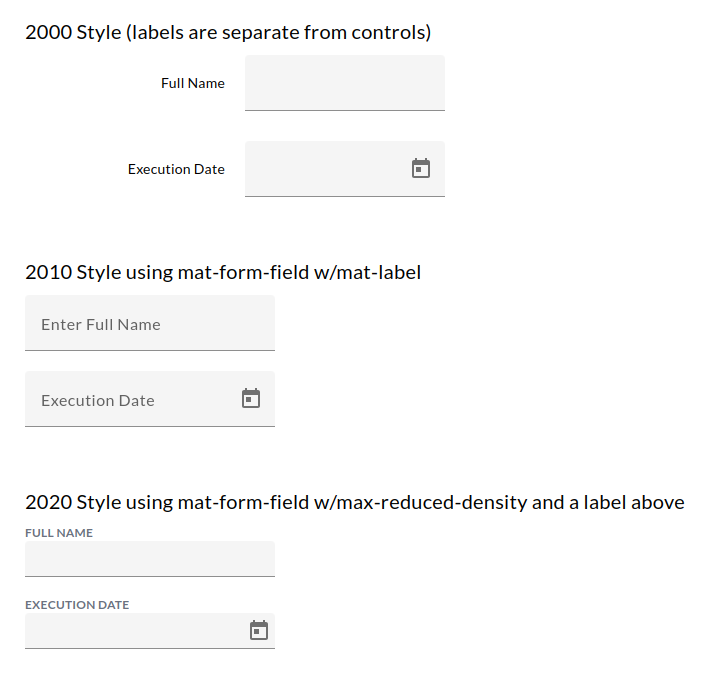

```
Evolution of Labels over Time
-----------------------------

```

```


	1. The 2000 styles / create a label on the page

            +------------------------------------------------------+
            | Full Name      <wasted space>     Full-Name-Textbox  |
            | Priority       <wasted space>     Priority Dropdown  |
            +------------------------------------------------------+
            
            +------------------------------------------------------+
            | Full Name   Full-Name-Textbox       <wasted space>   |
            | Priority    Priority Dropdown       <wasted space>   |
            +------------------------------------------------------+
            
            - Labels use a LOT of space on the page
            - If browser stretches, the label is far away from the control
            + Easy to implement


	2. The 2010 style / use mat-label

            <mat-form-field>
            
                <mat-label>Enter Full Nme</mat-label>
            
                <input type="text" matInput title="Full Name" aria-label="Full Name"/>
            
            </mat-form-field>
            
            + Lots of developers know it / it's been around a long time
            + Label is NEAR the control (no wasted space)
            + The label is always visible
            - The entire mat-form-field has a lot of height / it looks poofy!!!!


	3. The 2020s style / no mat-label / make the mat-form-field slimmer / add a label above it

            <span class="app-form-label">Full Name</span>
            <mat-form-field class="max-reduced-density">
            
                <input type="text" matInput title="Full Name" aria-label="Full Name"/>
            
            </mat-form-field>
            
            + Label is NEAR the control
            + The label is always visible
            + Less Poofy


 How to create a max-reduced-density class that can be applied to any page
 -------------------------------------------------------------------------
	1. Define the max-reduced-density in the styles.scss


		@use '@angular/material' as mat;            // Make this the *FIRST* line in the styles.scss


		.max-reduced-density {
		  /* Tell the form field to use less padding.  Angular Material ranges from 0 (normal) to -5 (less padding)  */
		  @include mat.form-field-density(-5);
		}


	2. Apply the max-reduced-density to our <mat-form-field> tag

		<mat-form-field class="max-reduced-density">
			<!-- Do not add a mat-label here because you won't see it!!!! -->


		</mat-form-field>


 How to apply "max-reduced-density" and "app-form-label" to make the new look & feel
 -----------------------------------------------------------------------------------
	1. Define the app-form-label in the styles.scss

	.app-form-label {
			 --tw-text-opacity: 1;
			  color: rgb(107 114 128);
			  text-transform: uppercase;
			  font-weight: 700;
			  font-size: 0.75rem;
			  line-height: 1rem;
			  display: block;
	  }


	2. Use the app-form-label to put a label directly ABOVE the smaller mat-form-field

		<span class="app-form-label">This is my Label</span>
		<mat-form-field class="max-reduced-density">
			<!-- Do not add a mat-label here because you won't see it!!!! -->


		</mat-form-field>


 How to apply "max-reduced-calendar" and "app-form-label" to make the calendar popups smaller
 ---------------------------------------------------------------------------------------------
  1. Define the max-reduced-calendar in the styles.scss

		  mat-datepicker-toggle.max-reduced-calendar .mat-mdc-icon-button.mat-mdc-button-base {
			 	/* Reduce the height of the date picker box that has class="max-reduced-calendar" */
			 	padding: 0 8px;
			   	--mdc-icon-button-state-layer-size: 36px !important;
		  }


 2. Set the height of the date picker mat-form-field to 36px and apply the "max-reduced-calendar" to the date toggle
	Now, this textbox will align with this date-picker

         <div class="flex flex-row gap-x-2.5">
           <div>
             <span class="app-form-label">Contract Spec Date</span>

             <!-- Set the height to be 36px so it aligns with the text box next to it -->
             <mat-form-field class="max-reduced-density !h-[36px]" subscriptSizing="dynamic">
               <!-- Date picker field -->
               <input matInput [matDatepicker]="contractSpecDatePicker" formControlName="contractSpecExecutionDate">

               <!-- Date picker toggle icon -->
               <mat-datepicker-toggle class="max-reduced-calendar" matIconSuffix [for]="contractSpecDatePicker"></mat-datepicker-toggle>
               <mat-datepicker #contractSpecDatePicker></mat-datepicker>
             </mat-form-field>
           </div>

           <div>
             <span class="app-form-label">Extra Days</span>
             <mat-form-field subscriptSizing="dynamic" class="max-reduced-density"> <!-- Took out the max-reduced-density because the time field doesn't reduce -->
               <!-- Extra Days Text Box -->
               <input matInput title="Extra Days" aria-label="Extra Days" formControlName="extraDays">
             </mat-form-field>
           </div>
         </div>

```